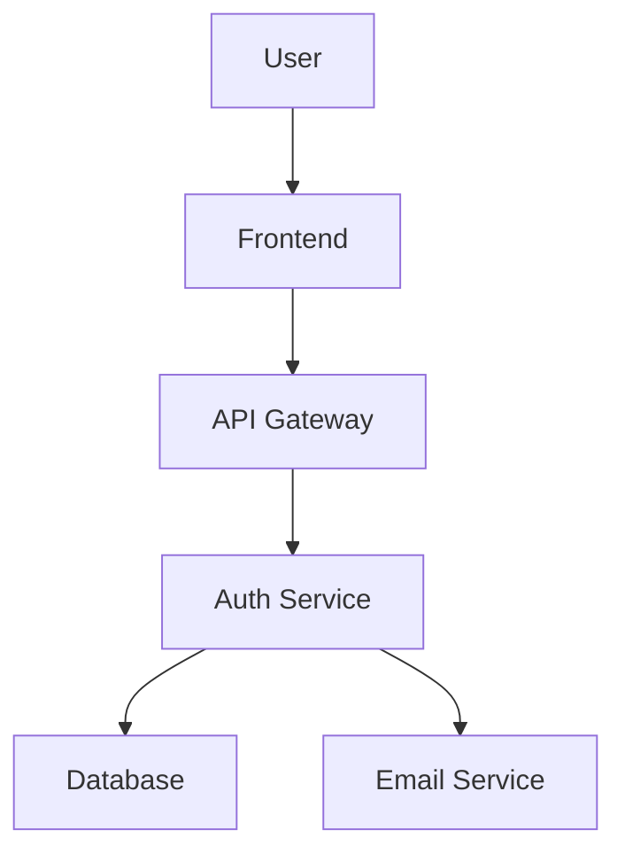

# Demo User Authentication Epic

This epic demonstrates a complete user authentication system implementation.

## Overview

This epic covers:
- User registration and login
- Password hashing and security
- JWT token management
- Session handling
- Account verification

## Architecture



## Components

### 1. Authentication API
- `/api/auth/register` - User registration
- `/api/auth/login` - User login
- `/api/auth/logout` - User logout
- `/api/auth/verify` - Email verification

### 2. User Model
- Email validation
- Password strength requirements
- Profile management
- Account status tracking

### 3. Security Features
- bcrypt password hashing
- JWT token signing
- Rate limiting
- CSRF protection

## Implementation Status

- ✅ User registration endpoint
- ✅ Password hashing
- ✅ JWT token generation
- 🔄 Email verification
- ⏸️ Password reset flow

## Testing

Run the test suite with:
```bash
npm test
```

## Deployment

The authentication service is deployed with Docker:
```bash
docker build -t auth-service .
docker run -p 3000:3000 auth-service
```