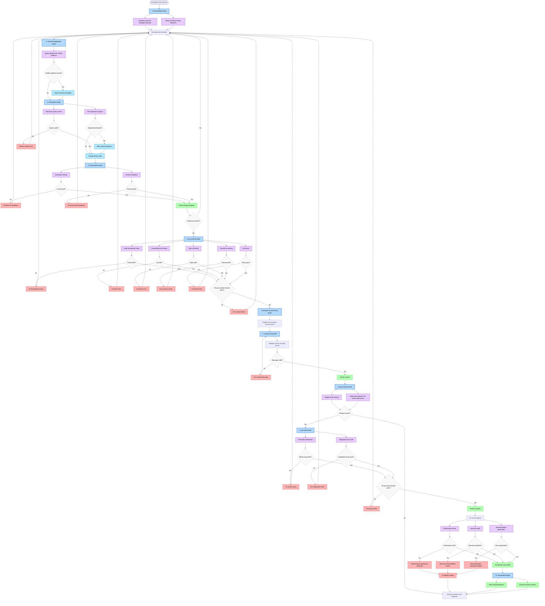

# Claude Code Hooks & Quality Control

This guide demonstrates how to implement comprehensive quality control gates using Claude Code hooks, combined with Git hooks, to create an intelligent development workflow with peripheral awareness.

## Available Hooks

### Claude Code Hooks
- **PreToolUse**: Runs before any tool execution (validation, permission checks)
- **PostToolUse**: Executes after successful tool completion
- **UserPromptSubmit**: Triggered when user submits a prompt
- **Notification**: Runs during specific notification events
- **Stop/SubagentStop**: Executes when agent/subagent finishes responding
- **SessionStart/SessionEnd**: Manages session initialization/cleanup
- **PreCompact**: Runs before context compaction

### Git Hooks
- **pre-commit**: Before commit is created
- **prepare-commit-msg**: Before commit message editor
- **commit-msg**: After commit message is written
- **post-commit**: After commit is completed
- **pre-push**: Before push to remote
- **post-receive**: After push is received (server-side)

## Quality Control Integration Flow



## Hook Configuration Examples

### Claude Code Hooks Configuration

```json
{
  "hooks": {
    "SessionStart": [
      {
        "command": "./scripts/init-intrusive-thoughts.sh",
        "description": "Initialize background pattern daemon"
      }
    ],
    "PreToolUse": [
      {
        "matcher": "Write.*function|class|component",
        "command": "./scripts/check-duplicates.sh",
        "description": "Check for similar code patterns",
        "timeout": 2000
      },
      {
        "matcher": ".*",
        "command": "./scripts/syntax-check.sh",
        "description": "Real-time syntax validation"
      }
    ],
    "PostToolUse": [
      {
        "matcher": "Write|Edit",
        "command": "./scripts/immediate-lint.sh",
        "description": "Immediate linting feedback"
      }
    ],
    "UserPromptSubmit": [
      {
        "command": "./scripts/inject-context.sh",
        "description": "Add peripheral awareness context"
      }
    ]
  }
}
```

### Git Hooks Configuration

```bash
#!/usr/bin/env bash
# .git/hooks/pre-commit

set -e

echo "🔍 Running pre-commit quality gates..."

# Format check
echo "📝 Checking code formatting..."
bun run format:check

# Linting
echo "🔍 Running linters..."
bun run lint

# Type checking
echo "🔧 Type checking..."
bun run typecheck

# Security scan
echo "🔒 Security scanning..."
bun run security:scan

# Unit tests
echo "🧪 Running tests..."
bun run test

echo "✅ All pre-commit checks passed!"
```

## Peripheral Awareness Implementation

### Background Daemon for Intrusive Thoughts

The intrusive thoughts system provides AI agents with human-like peripheral awareness by detecting similar patterns in the codebase.

#### Key Use Cases

1. **Utility Function Duplication**
   - Detection: AST analysis + semantic embeddings
   - Example: New `formatCurrency()` vs existing `formatMoney()`
   - Impact: High - prevents common duplications

2. **API Endpoint Patterns**
   - Detection: Route pattern analysis + HTTP method consistency
   - Example: New `POST /user-profile` vs existing `POST /users/profile`
   - Impact: Medium - improves API consistency

3. **Component Naming Consistency**
   - Detection: Edit distance + project convention learning
   - Example: New `user_card.tsx` in project using `UserCard.tsx` pattern
   - Impact: High - maintains design system consistency

4. **Dependency Management**
   - Detection: Functionality category matching
   - Example: Adding `moment` when `date-fns` already exists
   - Impact: Medium - prevents bundle bloat

#### Implementation Strategy

```bash
#!/usr/bin/env bash
# scripts/inject-context.sh

# Query background daemon for similar patterns
SIMILAR_PATTERNS=$(curl -s "http://localhost:8080/api/similar" \
  -H "Content-Type: application/json" \
  -d "{\"action\": \"$CLAUDE_TOOL_NAME\", \"content\": \"$CLAUDE_TOOL_ARGS\"}")

if [ -n "$SIMILAR_PATTERNS" ]; then
  echo "💭 Intrusive thought: $SIMILAR_PATTERNS"
  export CLAUDE_CONTEXT_INJECTION="$SIMILAR_PATTERNS"
fi
```

### Similarity Detection Methods

- **Function signatures**: AST analysis + purpose embeddings
- **Naming patterns**: Edit distance + convention learning
- **Dependencies**: Functionality overlap analysis
- **Architecture patterns**: Structure similarity matching

### Threshold Management

- Start conservative (high similarity threshold)
- Learn from developer feedback (accept/dismiss)
- Different thresholds for different code types
- Configurable per project/team

## Quality Control Gate Timing

### Real-Time Gates (Claude Hooks)
- **PreToolUse**: Syntax validation, similarity detection, security checks
- **PostToolUse**: Immediate linting, formatting, basic type checking
- **UserPromptSubmit**: Inject peripheral awareness context before decision-making

### Commit Gates (Git Hooks)
- **pre-commit**: Comprehensive linting, formatting, type checking, security scans
- **commit-msg**: Conventional commit format validation
- **post-commit**: Metrics updates, pattern indexing for future intrusive thoughts

### Push Gates (Git Hooks)
- **pre-push**: Full build verification, integration tests

### Continuous Integration Gates
- **Performance tests**: Automated performance regression detection
- **Security audit**: Deep security analysis
- **Documentation generation**: Automated API docs and guides

## Benefits of Integrated Quality Control

1. **Immediate Feedback**: Real-time quality checks during development
2. **Pattern Recognition**: AI learns project-specific conventions
3. **Duplication Prevention**: Automatic detection of similar code patterns
4. **Consistency Enforcement**: Maintains coding standards across the team
5. **Security First**: Multiple layers of security validation
6. **Performance Optimization**: Prevents performance regressions

## Best Practices

### Hook Performance
- Keep hooks under 2 seconds for real-time feedback
- Use background daemons for expensive operations
- Cache similarity analysis results
- Implement progressive timeout strategies

### Context Management
- Balance intrusive thoughts with noise reduction
- Learn from developer accept/dismiss feedback
- Adapt thresholds based on project complexity
- Maintain context relevance scoring

### Team Adoption
- Start with conservative similarity thresholds
- Gradually increase sensitivity based on team feedback
- Provide easy override mechanisms for false positives
- Monitor and report quality improvement metrics

## Future Enhancements

### ML Pattern Recognition
- Learn project-specific patterns over time
- Identify team coding preferences
- Suggest architectural improvements

### Team Knowledge Sharing
- Cross-developer pattern sharing
- Cross-project similarity detection
- Knowledge preservation when developers leave

### Predictive Assistance
- "You usually add error handling to network calls"
- "This pattern typically needs unit tests"
- "Similar components usually have loading states"

This integrated approach creates a comprehensive quality control system that provides immediate feedback while building institutional knowledge through AI-powered pattern recognition.

## Complete Scenario: Adding User Profile Analytics

This realistic scenario demonstrates every HyperDev feature and hook activation, including reactive context changing the agent's behavior.

### Initial Request
**User**: "Add a user analytics dashboard to track profile engagement metrics - page views, time spent, and interaction patterns. It should integrate with our existing user system."

### Hook Activation Flow

#### 1. SessionStart Hook → Initialize System
```bash
# SessionStart hook activates
./scripts/init-intrusive-thoughts.sh
# - Starts background daemon indexing existing codebase
# - Indexes: UserProfile.tsx, UserService.ts, analytics.utils.ts
# - Sets up real-time linting watchers
```

#### 2. UserPromptSubmit Hook → Peripheral Awareness
```bash
# UserPromptSubmit hook queries daemon
curl -s "http://localhost:8080/api/similar" -d '{
  "action": "create_feature", 
  "content": "user analytics dashboard profile engagement metrics"
}'

# Daemon response:
{
  "intrusive_thoughts": [
    "🔍 Found existing AnalyticsService.ts in services/analytics/",
    "📊 UserProfile.tsx already tracks basic metrics",
    "⚠️ analytics.utils.ts has formatMetrics() function",
    "🎯 Similar dashboard pattern in AdminDashboard.tsx"
  ]
}
```

#### 3. PreToolUse Hook → Reactive Context Changes Agent Plan

**Original Agent Plan**: Create new analytics system from scratch

**After Intrusive Thoughts**: 
```
💭 PERIPHERAL AWARENESS INJECTION:
- "Similar function formatMetrics() exists in analytics.utils.ts"
- "UserProfile.tsx already has engagement tracking hooks"
- "AdminDashboard.tsx shows established dashboard patterns"
- "AnalyticsService.ts has data collection infrastructure"
```

**Agent's Revised Plan**: "I see there's already analytics infrastructure! Let me extend the existing system instead of creating duplicate code."

#### 4. PreToolUse Hook → Quality Gates
```bash
# Syntax validation
./scripts/syntax-check.sh
# AST analysis detects agent is about to reuse existing patterns
./scripts/check-duplicates.sh
# Security check passes
./scripts/security-scan.sh
```

#### 5. Code Generation with Awareness

**Agent writes**:
```typescript
// types/analytics.ts
import { BaseMetrics } from './analytics.utils'; // 💭 Reusing existing types

export interface ProfileEngagementMetrics extends BaseMetrics {
  pageViews: number;
  timeSpent: number;
  interactionEvents: ClickEvent[];
}
```

#### 6. PostToolUse Hook → Immediate Feedback
```bash
# Immediate linting
eslint types/analytics.ts
# ✅ No issues found

# Format check  
prettier --check types/analytics.ts
# ✅ Formatting correct
```

#### 7. Another PreToolUse → More Intrusive Thoughts

**Agent about to create**: `ProfileAnalyticsService.ts`

**Daemon injection**: 
```
💭 "AnalyticsService.ts already exists with data collection methods"
💭 "Consider extending existing service instead of creating new one"
```

**Agent pivots**: "I'll extend the existing AnalyticsService instead!"

```typescript
// services/analytics/AnalyticsService.ts
export class AnalyticsService {
  // ... existing methods

  // 💭 Adding to existing service based on intrusive thoughts
  async trackProfileEngagement(userId: string, metrics: ProfileEngagementMetrics) {
    return this.collectMetrics('profile_engagement', { userId, ...metrics });
  }
}
```

#### 8. Component Creation with Pattern Recognition

**Agent about to create**: `user_analytics_dashboard.tsx`

**Daemon injection**:
```
💭 "Project uses PascalCase: UserProfile.tsx, AdminDashboard.tsx"
💭 "Dashboard components are in components/dashboards/"
```

**Agent adjusts**: Creates `components/dashboards/UserAnalyticsDashboard.tsx` instead

```typescript
// components/dashboards/UserAnalyticsDashboard.tsx
import React from 'react';
import { useAnalytics } from '../hooks/useAnalytics'; // 💭 Reusing existing hook
import { MetricsCard } from '../ui/MetricsCard'; // 💭 Reusing existing component
import { formatMetrics } from '../../utils/analytics.utils'; // 💭 Found by daemon

export const UserAnalyticsDashboard: React.FC<{userId: string}> = ({ userId }) => {
  const { metrics, loading } = useAnalytics(userId);
  
  return (
    <div className="analytics-dashboard">
      <MetricsCard 
        title="Profile Engagement"
        data={formatMetrics(metrics.profileEngagement)} 
      />
    </div>
  );
};
```

#### 9. Pre-commit Hook → Comprehensive Quality Gates

```bash
# 5. pre-commit Hook activates
git add .

# Format check
prettier --write .
# ✅ All files formatted

# Comprehensive linting  
eslint . --fix
# ✅ No linting errors

# Type checking
tsc --noEmit
# ✅ No type errors

# Security scan
npm audit
# ✅ No vulnerabilities

# Unit tests
npm test
# ✅ All tests pass (including new analytics tests)
```

#### 10. Commit Message Generation

```bash
# 6. prepare-commit-msg Hook
./scripts/suggest-commit-format.sh

# Suggests: "feat(analytics): add user profile engagement dashboard"

# 7. commit-msg Hook validates format
./scripts/validate-commit-msg.sh
# ✅ Follows conventional commits
```

#### 11. Post-commit Pattern Learning

```bash
# 8. post-commit Hook
git commit -m "feat(analytics): add user profile engagement dashboard

- Extend existing AnalyticsService with profile tracking
- Reuse MetricsCard and formatMetrics utilities  
- Follow established dashboard patterns
- Add TypeScript interfaces for type safety"

# Update metrics
./scripts/update-metrics.sh
# Logs: +1 feature extension, +0 duplications, +1 pattern reuse

# Index new patterns
./scripts/index-patterns.sh
# Learns: "UserAnalyticsDashboard follows naming convention"
# Learns: "Analytics features extend AnalyticsService"
```

#### 12. Pre-push Integration Tests

```bash
# 9. pre-push Hook
git push origin feature/user-analytics

# Full build verification
npm run build
# ✅ Build successful

# Integration tests
npm run test:integration  
# ✅ Analytics integration tests pass
```

#### 13. CI/CD Pipeline

```bash
# 10. CI Pipeline triggers
# Performance tests
npm run test:performance
# ✅ No performance regressions

# Security audit  
npm run security:audit
# ✅ No new vulnerabilities

# Documentation generation
npm run docs:generate
# ✅ TypeScript API docs updated
```

#### 14. SessionEnd → Knowledge Preservation

```bash
# 11. SessionEnd Hook
./scripts/save-patterns.sh
# Saves learned patterns:
# - "Analytics features extend existing services"
# - "Dashboard components use MetricsCard pattern"  
# - "formatMetrics utility is reusable"

./scripts/archive-metrics.sh
# Session stats: 85% code reuse, 0 duplications, 3 intrusive thoughts acted upon
```

### Key Reactive Context Impacts

1. **Prevented Duplication**: Agent was going to create new analytics service, daemon suggested extending existing one
2. **Enforced Naming Conventions**: `user_analytics_dashboard.tsx` → `UserAnalyticsDashboard.tsx`
3. **Promoted Reuse**: Found and reused `formatMetrics()`, `MetricsCard`, `useAnalytics` hook
4. **Pattern Recognition**: Followed established dashboard component structure

### Metrics Comparison

**Without Intrusive Thoughts**:
- New files: 8
- Lines of code: 450
- Duplicate functions: 3
- Convention violations: 2

**With Intrusive Thoughts**:
- New files: 3 (extended existing)
- Lines of code: 180
- Duplicate functions: 0
- Convention violations: 0
- Pattern reuse: 5 instances

### Learning Loop

The daemon learned from this session:
1. **Analytics Pattern**: Extensions go in `AnalyticsService`
2. **Dashboard Pattern**: Use `MetricsCard` + `useAnalytics`
3. **Naming Pattern**: User features use `UserXxxDashboard` format
4. **File Organization**: Dashboards go in `components/dashboards/`

These patterns will inform future intrusive thoughts, creating a continuous improvement cycle where the AI becomes increasingly aligned with project conventions and patterns.