# User Analytics Dashboard: Complete Implementation Scenario

This realistic scenario demonstrates every HyperDev feature and hook activation when a user requests: **"Add a user analytics dashboard to track profile engagement metrics."**

## Scenario Flow Diagram

```mermaid
---
config:
  layout: dagre
---
flowchart TD
    UserRequest@{ label: "👤 User Request:<br>'Add user analytics dashboard<br>for profile engagement metrics'" } --> SessionStart["🚀 1. SessionStart Hook"]
    SessionStart --> InitDaemon["Initialize intrusive<br>thoughts daemon"] & SetupWatchers["Setup real-time<br>linting watchers"]
    InitDaemon --> IndexExisting["📂 Index existing codebase:<br>• AnalyticsService.ts<br>• UserProfile.tsx<br>• analytics.utils.ts<br>• AdminDashboard.tsx"]
    SetupWatchers --> UserPromptHook["📝 2. UserPromptSubmit Hook"]
    IndexExisting --> UserPromptHook
    UserPromptHook --> QueryDaemon["🔍 Query daemon for<br>similar patterns"]
    QueryDaemon --> ThoughtsFound["Intrusive thoughts<br>found?"]
    ThoughtsFound -- YES --> InjectThoughts["💭 Inject peripheral awareness:<br>• Found AnalyticsService.ts<br>• UserProfile.tsx has metrics<br>• formatMetrics() exists<br>• AdminDashboard.tsx pattern"]
    ThoughtsFound -- NO --> OriginalPlan["🤖 Original Agent Plan:<br>Create new analytics<br>system from scratch"]
    InjectThoughts --> RevisedPlan@{ label: "🧠 Agent revises plan:<br>'Extend existing analytics<br>instead of creating new'" }
    OriginalPlan --> PreToolUse1["⚡ 3a. PreToolUse Hook"]
    RevisedPlan --> PreToolUse1
    PreToolUse1 --> ASTAnalysis1["AST duplicate analysis"] & SyntaxCheck1["Real-time syntax check"] & SecurityCheck1["Security validation"]
    ASTAnalysis1 --> WriteTypes["✍️ Write types/analytics.ts<br>extending BaseMetrics"]
    SyntaxCheck1 --> WriteTypes
    SecurityCheck1 --> WriteTypes
    WriteTypes --> PostTool1["⚡ 4a. PostToolUse Hook"]
    PostTool1 --> LintTypes["Lint types/analytics.ts"] & FormatTypes["Format validation"]
    LintTypes --> TypesOK{"Types valid?"}
    FormatTypes --> TypesOK
    TypesOK -- YES --> PreToolUse2["⚡ 3b. PreToolUse Hook"]
    TypesOK -- NO --> FixTypes["Fix type issues"]
    FixTypes --> PreToolUse1
    PreToolUse2 --> AboutToCreate["Agent about to create:<br>ProfileAnalyticsService.ts"]
    AboutToCreate --> DaemonWarns@{ label: "💭 Daemon injection:<br>'AnalyticsService.ts already<br>exists - extend instead!'" }
    DaemonWarns --> AgentPivots@{ label: "🧠 Agent pivots:<br>'I'll extend existing<br>AnalyticsService instead!'" }
    AgentPivots --> ExtendService["✍️ Extend AnalyticsService<br>with trackProfileEngagement()"]
    ExtendService --> PostTool2["⚡ 4b. PostToolUse Hook"]
    PostTool2 --> ServiceOK{"Service extension<br>valid?"}
    ServiceOK -- YES --> PreToolUse3["⚡ 3c. PreToolUse Hook"]
    ServiceOK -- NO --> FixService["Fix service issues"]
    FixService --> PreToolUse2
    PreToolUse3 --> AboutComponent["Agent about to create:<br>user_analytics_dashboard.tsx"]
    AboutComponent --> ConventionWarning@{ label: "💭 Daemon injection:<br>'Project uses PascalCase:<br>UserProfile.tsx, AdminDashboard.tsx<br>Components go in components/dashboards/'" }
    ConventionWarning --> AgentAdjusts@{ label: "🧠 Agent adjusts:<br>'Create UserAnalyticsDashboard.tsx<br>in components/dashboards/'" }
    AgentAdjusts --> WriteComponent["✍️ Write UserAnalyticsDashboard<br>reusing MetricsCard, useAnalytics"]
    WriteComponent --> PostTool3["⚡ 4c. PostToolUse Hook"]
    PostTool3 --> ComponentOK{"Component valid?"}
    ComponentOK -- YES --> ReadyCommit["📋 Ready to commit"]
    ComponentOK -- NO --> FixComponent["Fix component issues"]
    FixComponent --> PreToolUse3
    ReadyCommit --> PreCommit["🔒 5. pre-commit Hook"]
    PreCommit --> FormatAll["Code formatting check"] & LintAll["Comprehensive linting"] & TypeCheck["Type checking"] & SecurityScan["Security scanning"] & UnitTests["Unit tests"]
    FormatAll --> AllChecks{"All pre-commit<br>checks pass?"}
    LintAll --> AllChecks
    TypeCheck --> AllChecks
    SecurityScan --> AllChecks
    UnitTests --> AllChecks
    AllChecks -- NO --> FixIssues["Fix quality issues"]
    AllChecks -- YES --> PrepareMsg["📝 6. prepare-commit-msg Hook"]
    FixIssues --> PreCommit
    PrepareMsg --> SuggestFormat["Suggest conventional<br>commit format"]
    SuggestFormat --> CommitMsg["📝 7. commit-msg Hook"]
    CommitMsg --> ValidateMsg{"Commit message<br>valid?"}
    ValidateMsg -- NO --> FixMsg["Fix commit message"]
    ValidateMsg -- YES --> CreateCommit["📦 Create commit"]
    FixMsg --> CommitMsg
    CreateCommit --> PostCommit["📈 8. post-commit Hook"]
    PostCommit --> UpdateMetrics["Update code metrics:<br>+0 duplications<br>+1 pattern reuse<br>+1 feature extension"] & IndexNewPatterns["Index new patterns:<br>• Analytics extend service<br>• Dashboard naming convention<br>• MetricsCard reuse pattern"]
    UpdateMetrics --> ReadyPush{"Ready to push?"}
    IndexNewPatterns --> ReadyPush
    ReadyPush -- NO --> SessionEnd["🏁 11. SessionEnd Hook"]
    ReadyPush -- YES --> PrePush["🚀 9. pre-push Hook"]
    PrePush --> FullBuild["Full build verification"] & IntegrationTests["Integration test suite"]
    FullBuild --> BuildOK{"Build successful?"}
    IntegrationTests --> TestsOK{"Integration tests pass?"}
    BuildOK -- NO --> FixBuild["Fix build issues"]
    TestsOK -- NO --> FixTests["Fix integration tests"]
    FixBuild --> PrePush
    FixTests --> PrePush
    BuildOK -- YES --> PushOK{"All pre-push<br>checks pass?"}
    TestsOK -- YES --> PushOK
    PushOK -- NO --> FixPushIssues["Fix push issues"]
    PushOK -- YES --> PushCode["📤 Push to remote"]
    FixPushIssues --> PrePush
    PushCode --> CI["🔄 10. CI/CD Pipeline"]
    CI --> PerfTests["Performance tests"] & SecAudit["Security audit"] & DocsGen["Documentation generation"]
    PerfTests --> CIResult{"CI Pipeline<br>successful?"}
    SecAudit --> CIResult
    DocsGen --> CIResult
    CIResult -- NO --> CIFail["❌ CI Pipeline failed"]
    CIResult -- YES --> CISuccess["✅ CI Pipeline successful"]
    CISuccess --> SessionEnd
    CIFail --> SessionEnd
    SessionEnd --> SavePatterns["💾 Save learned patterns:<br>• Analytics features extend services<br>• Dashboard components use MetricsCard<br>• formatMetrics utility is reusable"] & ArchiveMetrics["📊 Archive session metrics:<br>85% code reuse<br>0 duplications<br>3 intrusive thoughts acted upon"]
    SavePatterns --> Complete["🎉 Feature Complete"]
    ArchiveMetrics --> Complete
    
    %% Legend
    subgraph Legend["🔍 Color Legend"]
        direction LR
        LegendHook["Hooks<br/>System integration points"]
        LegendQuality["Quality Gates<br/>Automated checks"]
        LegendDecision["Decisions<br/>Flow control points"]
        LegendError["Error States<br/>Issues needing fixes"]
        LegendSuccess["Success States<br/>Completed actions"]
        LegendThought["Intrusive Thoughts<br/>AI peripheral awareness"]
        LegendAgent["Agent Actions<br/>AI decision changes"]
        LegendUser["User Interactions<br/>Human-initiated actions"]
    end
    
    UserRequest@{ shape: rect}
    RevisedPlan@{ shape: rect}
    DaemonWarns@{ shape: rect}
    AgentPivots@{ shape: rect}
    ConventionWarning@{ shape: rect}
    AgentAdjusts@{ shape: rect}
     UserRequest:::userNode
     SessionStart:::hookNode
     InitDaemon:::qualityGate
     SetupWatchers:::qualityGate
     IndexExisting:::qualityGate
     UserPromptHook:::hookNode
     QueryDaemon:::qualityGate
     ThoughtsFound:::decisionNode
     InjectThoughts:::thoughtNode
     RevisedPlan:::agentNode
     PreToolUse1:::hookNode
     ASTAnalysis1:::qualityGate
     SyntaxCheck1:::qualityGate
     SecurityCheck1:::qualityGate
     WriteTypes:::successNode
     PostTool1:::hookNode
     LintTypes:::qualityGate
     FormatTypes:::qualityGate
     TypesOK:::decisionNode
     PreToolUse2:::hookNode
     FixTypes:::errorNode
     DaemonWarns:::thoughtNode
     AgentPivots:::agentNode
     ExtendService:::qualityGate
     PostTool2:::hookNode
     ServiceOK:::decisionNode
     PreToolUse3:::hookNode
     FixService:::errorNode
     ConventionWarning:::thoughtNode
     AgentAdjusts:::agentNode
     WriteComponent:::qualityGate
     PostTool3:::hookNode
     ComponentOK:::decisionNode
     FixComponent:::errorNode
     PreCommit:::hookNode
     FormatAll:::qualityGate
     LintAll:::qualityGate
     TypeCheck:::qualityGate
     SecurityScan:::qualityGate
     UnitTests:::qualityGate
     AllChecks:::decisionNode
     FixIssues:::errorNode
     PrepareMsg:::hookNode
     CommitMsg:::hookNode
     ValidateMsg:::decisionNode
     FixMsg:::errorNode
     CreateCommit:::successNode
     PostCommit:::hookNode
     UpdateMetrics:::qualityGate
     IndexNewPatterns:::qualityGate
     ReadyPush:::decisionNode
     SessionEnd:::hookNode
     PrePush:::hookNode
     FullBuild:::qualityGate
     IntegrationTests:::qualityGate
     BuildOK:::decisionNode
     TestsOK:::decisionNode
     FixBuild:::errorNode
     FixTests:::errorNode
     PushOK:::decisionNode
     FixPushIssues:::errorNode
     PushCode:::successNode
     PerfTests:::qualityGate
     SecAudit:::qualityGate
     DocsGen:::qualityGate
     CIResult:::decisionNode
     CIFail:::errorNode
     CISuccess:::successNode
     SavePatterns:::successNode
     ArchiveMetrics:::successNode
     Complete:::successNode
     LegendHook:::hookNode
     LegendQuality:::qualityGate
     LegendDecision:::decisionNode
     LegendError:::errorNode
     LegendSuccess:::successNode
     LegendThought:::thoughtNode
     LegendAgent:::agentNode
     LegendUser:::userNode
    %% Semantic coloring - only differentiate by meaning, not shape
    classDef hookNode fill:#b3d9ff,stroke:#4d94ff,stroke-width:3px,color:#333333
    classDef qualityGate fill:#e6ccff,stroke:#b366ff,stroke-width:2px,color:#333333
    classDef decisionNode fill:#f8f8f8,stroke:#cccccc,stroke-width:2px,color:#333333
    classDef errorNode fill:#ffb3b3,stroke:#ff6666,stroke-width:2px,color:#333333
    classDef successNode fill:#b3ffb3,stroke:#66ff66,stroke-width:2px,color:#333333
    classDef thoughtNode fill:#fff2b3,stroke:#ffcc33,stroke-width:2px,color:#333333
    classDef agentNode fill:#b3e6ff,stroke:#33b3ff,stroke-width:2px,color:#333333
    classDef userNode fill:#ffd9b3,stroke:#ff9933,stroke-width:3px,color:#333333
```

## Key Reactive Context Changes

### 1. **Service Architecture Decision**
- **Original Plan**: Create `ProfileAnalyticsService.ts`
- **Intrusive Thought**: "AnalyticsService.ts already exists"
- **Agent Pivot**: Extend existing service instead
- **Impact**: Prevented code duplication, maintained architecture consistency

### 2. **Naming Convention Enforcement**
- **Original Plan**: `user_analytics_dashboard.tsx` 
- **Intrusive Thought**: "Project uses PascalCase: UserProfile.tsx, AdminDashboard.tsx"
- **Agent Adjustment**: `UserAnalyticsDashboard.tsx`
- **Impact**: Enforced project conventions automatically

### 3. **Component Reuse Discovery**
- **Original Plan**: Create new metrics display components
- **Intrusive Thought**: "MetricsCard component exists, useAnalytics hook available"
- **Agent Adaptation**: Reuse existing UI components
- **Impact**: 60% reduction in new code, consistent UI patterns

## Before vs After Metrics

| Metric | Without Intrusive Thoughts | With Intrusive Thoughts |
|--------|---------------------------|------------------------|
| **New Files Created** | 8 files | 3 files |
| **Lines of Code** | 450 lines | 180 lines |
| **Duplicate Functions** | 3 duplicates | 0 duplicates |
| **Convention Violations** | 2 violations | 0 violations |
| **Pattern Reuse** | 0 instances | 5 instances |
| **Code Reuse Percentage** | 25% | 85% |

## Learning Outcomes

The background daemon learned these patterns for future sessions:

1. **Service Extension Pattern**: Analytics features should extend `AnalyticsService`
2. **Component Naming**: User features follow `UserXxxDashboard` format  
3. **UI Component Reuse**: Dashboards should use `MetricsCard` + `useAnalytics`
4. **File Organization**: Dashboard components belong in `components/dashboards/`
5. **Utility Function Awareness**: `formatMetrics()` is available for data formatting

These learned patterns will inform future intrusive thoughts, creating a continuous improvement cycle where the AI becomes increasingly aligned with project-specific conventions and architectural decisions.