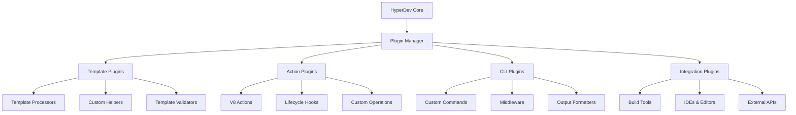

# Plugin & Extension Development

Extend HyperDev's capabilities with custom plugins, actions, and integrations. Build sophisticated extensions that integrate seamlessly with the core system.

## Plugin Architecture Overview

### Plugin System Design

HyperDev's plugin architecture provides multiple extension points for customization.



### Plugin Types and Capabilities

<CardGroup cols={2}>
  <Card title="Template Plugins" icon="file-code">
    Extend template processing capabilities
    - Custom template engines
    - Template validation rules
    - Helper function libraries
    - Template transformations
  </Card>

  <Card title="Action Plugins" icon="bolt">
    Add custom actions and operations
    - File system operations
    - API integrations
    - Code transformations
    - Workflow automation
  </Card>

  <Card title="CLI Plugins" icon="terminal">
    Extend command-line functionality
    - Custom commands
    - Output formatters
    - Interactive prompts
    - Command middleware
  </Card>

  <Card title="Integration Plugins" icon="puzzle-piece">
    Connect with external tools
    - IDE extensions
    - Build tool plugins
    - CI/CD integrations
    - API connectors
  </Card>
</CardGroup>

## Plugin Development Basics

### Plugin Structure and Setup

Create a well-structured plugin following HyperDev conventions.

```typescript
// src/index.ts - Main plugin entry point
import { HyperdevPlugin, PluginContext, PluginMetadata } from '@hyperdev/hyperdev';

export class MyCustomPlugin implements HyperdevPlugin {
  // Plugin metadata
  readonly metadata: PluginMetadata = {
    name: 'my-custom-plugin',
    version: '1.0.0',
    description: 'Custom plugin for specialized workflow',
    author: 'Your Name <email@example.com>',
    homepage: 'https://github.com/yourusername/my-custom-plugin',
    
    // Plugin capabilities
    capabilities: [
      'template_processing',
      'custom_actions', 
      'cli_commands',
      'lifecycle_hooks'
    ],
    
    // Compatibility and requirements
    engines: {
      hyperdev: '>=2.0.0'
    },
    
    // Plugin configuration schema
    config_schema: {
      type: 'object',
      properties: {
        enable_advanced_features: {
          type: 'boolean',
          default: true
        },
        api_endpoint: {
          type: 'string',
          format: 'uri'
        }
      }
    }
  };

  // Plugin initialization
  async initialize(context: PluginContext): Promise<void> {
    // Register custom actions
    context.registerAction('custom-transform', this.customTransform.bind(this));
    context.registerAction('api-integration', this.apiIntegration.bind(this));
    
    // Register template helpers
    context.registerHelper('customFormat', this.customFormat.bind(this));
    context.registerHelper('apiCall', this.apiCall.bind(this));
    
    // Register lifecycle hooks
    context.registerHook('pre_generation', this.preGeneration.bind(this));
    context.registerHook('post_generation', this.postGeneration.bind(this));
    
    // Register CLI commands
    context.registerCommand('custom-command', this.customCommand.bind(this));
    
    // Initialize plugin resources
    await this.setupResources(context.config);
  }

  // Cleanup on plugin unload
  async cleanup(context: PluginContext): Promise<void> {
    await this.closeConnections();
    this.clearCaches();
  }

  // Custom action implementation
  private async customTransform(context: ActionContext): Promise<void> {
    const { files, parameters } = context;
    
    // Implement custom transformation logic
    for (const file of files) {
      file.content = await this.transformContent(file.content, parameters);
    }
  }
}

export default MyCustomPlugin;
```

### Plugin Configuration

Define plugin configuration with validation and type safety.

```typescript
// Configuration schema and types
import { z } from 'zod';

export const PluginConfigSchema = z.object({
  enabled: z.boolean().default(true),
  
  features: z.object({
    advanced_processing: z.boolean().default(false),
    api_integration: z.boolean().default(true),
    custom_validators: z.boolean().default(true)
  }),
  
  api: z.object({
    endpoint: z.string().url(),
    timeout: z.number().min(1000).max(30000).default(5000),
    retries: z.number().min(0).max(5).default(3),
    
    authentication: z.object({
      type: z.enum(['none', 'api_key', 'oauth', 'bearer']),
      credentials: z.record(z.string()).optional()
    })
  }).optional(),
  
  processing: z.object({
    batch_size: z.number().min(1).max(100).default(10),
    parallel_processing: z.boolean().default(true),
    cache_enabled: z.boolean().default(true)
  })
});

export type PluginConfig = z.infer<typeof PluginConfigSchema>;

// Plugin configuration validation
export class PluginConfigValidator {
  static validate(config: unknown): PluginConfig {
    try {
      return PluginConfigSchema.parse(config);
    } catch (error) {
      throw new PluginConfigError(`Invalid plugin configuration: ${error.message}`);
    }
  }
  
  static validatePartial(config: unknown): Partial<PluginConfig> {
    return PluginConfigSchema.partial().parse(config);
  }
}
```

## Advanced Plugin Development

### Custom Actions and Operations

Implement sophisticated actions with full lifecycle management.

```typescript
// Custom action with comprehensive functionality
import { Action, ActionContext, ActionResult } from '@hyperdev/hyperdev';

@Action({
  name: 'api-code-generator',
  description: 'Generate code from API specifications',
  parameters: {
    api_spec_url: {
      type: 'string',
      required: true,
      validation: /^https?:\/\/.+/
    },
    output_format: {
      type: 'select',
      options: ['typescript', 'javascript', 'python'],
      default: 'typescript'
    },
    include_tests: {
      type: 'boolean',
      default: true
    }
  }
})
export class ApiCodeGeneratorAction {
  constructor(
    private httpClient: HttpClient,
    private codeGenerator: CodeGenerator,
    private testGenerator: TestGenerator
  ) {}

  async execute(context: ActionContext): Promise<ActionResult> {
    const { api_spec_url, output_format, include_tests } = context.parameters;
    
    // Validate and fetch API specification
    const apiSpec = await this.fetchApiSpec(api_spec_url);
    const validatedSpec = await this.validateApiSpec(apiSpec);
    
    // Generate code files
    const generatedFiles = await this.generateApiClient(validatedSpec, output_format);
    
    // Generate tests if requested
    if (include_tests) {
      const testFiles = await this.generateTests(validatedSpec, output_format);
      generatedFiles.push(...testFiles);
    }
    
    // Apply code formatting and validation
    const formattedFiles = await this.formatCode(generatedFiles, output_format);
    
    // Return results with metadata
    return {
      files: formattedFiles,
      metadata: {
        api_spec_version: validatedSpec.version,
        endpoints_generated: validatedSpec.paths.length,
        models_generated: Object.keys(validatedSpec.components?.schemas || {}).length,
        generation_time: Date.now() - context.startTime
      },
      
      // Post-generation instructions
      instructions: [
        'Run `npm install` to install generated dependencies',
        'Update your API base URL in the configuration',
        'Review generated types for accuracy'
      ]
    };
  }

  private async fetchApiSpec(url: string): Promise<OpenAPISpec> {
    try {
      const response = await this.httpClient.get(url, {
        timeout: 10000,
        headers: { 'Accept': 'application/json, application/yaml' }
      });
      
      return this.parseApiSpec(response.data, response.headers['content-type']);
    } catch (error) {
      throw new ActionError(`Failed to fetch API spec from ${url}: ${error.message}`);
    }
  }

  private async generateApiClient(spec: OpenAPISpec, format: string): Promise<GeneratedFile[]> {
    const files: GeneratedFile[] = [];
    
    // Generate base client
    files.push(await this.codeGenerator.generateBaseClient(spec, format));
    
    // Generate endpoint implementations
    for (const [path, methods] of Object.entries(spec.paths)) {
      for (const [method, operation] of Object.entries(methods)) {
        const endpointFile = await this.codeGenerator.generateEndpoint(
          path, method, operation, format
        );
        files.push(endpointFile);
      }
    }
    
    // Generate type definitions
    if (spec.components?.schemas) {
      const typesFile = await this.codeGenerator.generateTypes(
        spec.components.schemas, format
      );
      files.push(typesFile);
    }
    
    return files;
  }
}
```

### Template Engine Extensions

Create custom template processors and helpers.

```typescript
// Custom template engine with advanced features
export class AdvancedTemplateProcessor {
  constructor(private config: ProcessorConfig) {}

  async processTemplate(
    templateContent: string, 
    context: TemplateContext
  ): Promise<ProcessedTemplate> {
    
    // Pre-process template with custom directives
    const preprocessed = await this.preProcessDirectives(templateContent);
    
    // Apply custom transformations
    const transformed = await this.applyTransformations(preprocessed, context);
    
    // Process with enhanced EJS
    const processed = await this.processEJS(transformed, context);
    
    // Post-process for optimization
    const optimized = await this.postProcessOptimizations(processed);
    
    return {
      content: optimized,
      metadata: this.extractMetadata(templateContent),
      dependencies: this.analyzeDependencies(optimized)
    };
  }

  // Custom template helpers
  registerHelpers(context: TemplateContext): void {
    // Advanced string manipulation
    context.registerHelper('pluralize', (word: string, count: number) => {
      return count === 1 ? word : this.pluralize(word);
    });
    
    // Code generation utilities
    context.registerHelper('generateInterface', (schema: JSONSchema) => {
      return this.generateTypeScriptInterface(schema);
    });
    
    // File system helpers
    context.registerHelper('readFile', async (path: string) => {
      return await this.safeReadFile(path);
    });
    
    // API integration helpers
    context.registerHelper('fetchData', async (url: string) => {
      return await this.cachedFetch(url);
    });
    
    // Validation helpers
    context.registerHelper('validate', (data: unknown, schema: JSONSchema) => {
      return this.validateData(data, schema);
    });
  }

  // Custom directive processing
  private async preProcessDirectives(content: string): Promise<string> {
    // Process @include directives
    content = await this.processIncludeDirectives(content);
    
    // Process @import directives  
    content = await this.processImportDirectives(content);
    
    // Process @config directives
    content = await this.processConfigDirectives(content);
    
    return content;
  }
}

// Register template engine extension
export class TemplateEnginePlugin implements HypergenPlugin {
  async initialize(context: PluginContext): Promise<void> {
    const processor = new AdvancedTemplateProcessor(context.config.processor);
    
    // Register custom template processor
    context.registerTemplateProcessor('advanced-ejs', processor);
    
    // Register template validators
    context.registerValidator('custom-syntax', this.validateCustomSyntax);
    context.registerValidator('performance-check', this.checkPerformance);
  }
}
```

### CLI Extensions

Add custom commands and enhance CLI functionality.

```typescript
// CLI plugin with custom commands
import { CLIPlugin, CommandContext, CommandDefinition } from '@hyperdev/hyperdev';

export class CustomCLIPlugin implements CLIPlugin {
  async initialize(context: PluginContext): Promise<void> {
    // Register custom commands
    context.registerCommand('analyze', this.analyzeCommand);
    context.registerCommand('optimize', this.optimizeCommand);
    context.registerCommand('scaffold', this.scaffoldCommand);
    
    // Register command middleware
    context.registerMiddleware('auth', this.authMiddleware);
    context.registerMiddleware('telemetry', this.telemetryMiddleware);
  }

  // Custom analyze command
  private analyzeCommand: CommandDefinition = {
    name: 'analyze',
    description: 'Analyze templates and provide insights',
    
    options: [
      {
        name: 'templates',
        alias: 't',
        type: 'string',
        description: 'Template directory to analyze',
        default: './templates'
      },
      {
        name: 'format',
        alias: 'f', 
        type: 'string',
        choices: ['json', 'table', 'markdown'],
        default: 'table'
      },
      {
        name: 'include-performance',
        type: 'boolean',
        description: 'Include performance analysis'
      }
    ],

    async handler(context: CommandContext) {
      const { templates, format, includePerformance } = context.options;
      
      console.log(`Analyzing templates in ${templates}...`);
      
      // Analyze template complexity
      const complexityResults = await this.analyzeComplexity(templates);
      
      // Analyze performance if requested
      let performanceResults;
      if (includePerformance) {
        performanceResults = await this.analyzePerformance(templates);
      }
      
      // Generate report
      const report = {
        summary: {
          total_templates: complexityResults.totalTemplates,
          avg_complexity: complexityResults.avgComplexity,
          high_complexity_templates: complexityResults.highComplexity.length
        },
        complexity: complexityResults,
        performance: performanceResults
      };
      
      // Output in requested format
      await this.outputReport(report, format);
    }
  };

  // Performance optimization command
  private optimizeCommand: CommandDefinition = {
    name: 'optimize',
    description: 'Optimize templates for better performance',
    
    options: [
      {
        name: 'templates',
        alias: 't',
        type: 'string',
        description: 'Template directory to optimize',
        required: true
      },
      {
        name: 'dry-run',
        type: 'boolean',
        description: 'Show optimizations without applying them'
      },
      {
        name: 'aggressive',
        type: 'boolean',
        description: 'Apply aggressive optimizations'
      }
    ],

    async handler(context: CommandContext) {
      const { templates, dryRun, aggressive } = context.options;
      
      // Discover optimization opportunities
      const opportunities = await this.findOptimizations(templates, { aggressive });
      
      if (opportunities.length === 0) {
        console.log('✅ No optimizations found. Templates are already optimized!');
        return;
      }
      
      console.log(`Found ${opportunities.length} optimization opportunities:`);
      
      for (const opportunity of opportunities) {
        console.log(`  ${opportunity.type}: ${opportunity.description}`);
        console.log(`    Impact: ${opportunity.impact}`);
        console.log(`    Files: ${opportunity.files.join(', ')}`);
        
        if (!dryRun) {
          await this.applyOptimization(opportunity);
          console.log(`    ✅ Applied`);
        }
      }
      
      if (dryRun) {
        console.log('\nRun without --dry-run to apply optimizations.');
      }
    }
  };

  // Authentication middleware
  private async authMiddleware(context: CommandContext, next: () => Promise<void>) {
    // Check if command requires authentication
    if (this.requiresAuth(context.command)) {
      const isAuthenticated = await this.checkAuthentication();
      
      if (!isAuthenticated) {
        console.error('Authentication required. Run `hyper login` first.');
        process.exit(1);
      }
    }
    
    await next();
  }
}
```

## Plugin Distribution and Management

### Plugin Package Structure

Organize plugins following npm package conventions.

```text
my-hyperdev-plugin/
├── src/
│   ├── index.ts              # Main plugin entry
│   ├── actions/             # Custom actions
│   ├── helpers/             # Template helpers
│   ├── commands/            # CLI commands
│   └── types/               # TypeScript definitions
├── templates/               # Example templates
├── tests/                   # Plugin tests
├── docs/                    # Plugin documentation
├── examples/                # Usage examples
├── package.json             # Package configuration
├── README.md                # Plugin documentation
├── CHANGELOG.md             # Version history
└── plugin.config.js         # Plugin configuration
```

### Plugin Publishing

Package and publish plugins to npm registry.

```json
{
  "name": "@yourorg/hyperdev-custom-plugin",
  "version": "1.0.0",
  "description": "Custom HyperDev plugin for specialized workflows",
  "keywords": ["hyperdev", "plugin", "code-generation"],
  
  "main": "dist/index.js",
  "types": "dist/index.d.ts",
  
  "files": [
    "dist/",
    "templates/",
    "README.md",
    "CHANGELOG.md"
  ],
  
  "engines": {
    "node": ">=16.0.0"
  },
  
  "peerDependencies": {
    "@hyperdev/hyperdev": ">=2.0.0"
  },
  
  "hyperdev": {
    "plugin": true,
    "category": "workflow",
    "capabilities": [
      "template_processing",
      "custom_actions",
      "cli_commands"
    ]
  },
  
  "scripts": {
    "build": "tsc",
    "test": "jest",
    "prepublishOnly": "npm run build && npm test"
  }
}
```

### Plugin Installation and Configuration

Users install and configure plugins seamlessly.

```bash
# Install plugin from npm
npm install -g @yourorg/hyperdev-custom-plugin

# Install plugin from local directory
hyper plugin install ./my-plugin

# List installed plugins
hyper plugin list

# Configure plugin
hyper plugin configure @yourorg/hyperdev-custom-plugin
```

```javascript
// hyperdev.config.js - Plugin configuration
export default {
  plugins: [
    // Simple plugin registration
    '@yourorg/hyperdev-custom-plugin',
    
    // Plugin with configuration
    {
      name: '@yourorg/hyperdev-custom-plugin',
      config: {
        enable_advanced_features: true,
        api: {
          endpoint: 'https://api.example.com',
          timeout: 5000
        }
      }
    },
    
    // Local plugin
    {
      path: './local-plugins/my-plugin',
      config: {
        development_mode: true
      }
    }
  ]
};
```

## Enterprise Plugin Development

### Enterprise Integration Patterns

Build plugins for enterprise environments with advanced features.

```typescript
// Enterprise plugin with advanced features
export class EnterpriseIntegrationPlugin implements HypergenPlugin {
  async initialize(context: PluginContext): Promise<void> {
    // Register enterprise actions
    context.registerAction('jira-integration', new JiraIntegrationAction());
    context.registerAction('confluence-docs', new ConfluenceDocsAction());
    context.registerAction('slack-notify', new SlackNotificationAction());
    
    // Register security validators
    context.registerValidator('security-scan', this.securityScanValidator);
    context.registerValidator('compliance-check', this.complianceValidator);
    
    // Register audit hooks
    context.registerHook('pre_generation', this.auditPreGeneration);
    context.registerHook('post_generation', this.auditPostGeneration);
    
    // Set up enterprise integrations
    await this.setupEnterpriseConnections(context.config);
  }

  private async setupEnterpriseConnections(config: PluginConfig) {
    // Initialize enterprise API connections
    this.jiraClient = new JiraClient(config.jira);
    this.confluenceClient = new ConfluenceClient(config.confluence);
    this.slackClient = new SlackClient(config.slack);
    
    // Set up monitoring and alerting
    this.monitoring = new PluginMonitoring(config.monitoring);
    
    // Initialize audit logging
    this.auditLogger = new AuditLogger(config.audit);
  }
}

// JIRA integration action
class JiraIntegrationAction {
  async execute(context: ActionContext): Promise<void> {
    const { ticket_id, update_status } = context.parameters;
    
    // Fetch JIRA ticket information
    const ticket = await this.jiraClient.getTicket(ticket_id);
    
    // Generate code based on ticket requirements
    const requirements = this.parseTicketRequirements(ticket);
    await this.generateCodeFromRequirements(requirements, context);
    
    // Update JIRA ticket with generation results
    if (update_status) {
      await this.jiraClient.updateTicket(ticket_id, {
        status: 'In Development',
        comment: `Code generation completed. Files: ${context.files.length}`
      });
    }
  }
}
```

### Plugin Security and Compliance

Implement security best practices in enterprise plugins.

```typescript
// Security-focused plugin development
export class SecurePluginBase implements HypergenPlugin {
  async initialize(context: PluginContext): Promise<void> {
    // Validate plugin permissions
    await this.validatePermissions(context);
    
    // Set up security monitoring
    this.securityMonitor = new PluginSecurityMonitor(context.config.security);
    
    // Initialize encryption for sensitive data
    this.encryption = new PluginEncryption(context.config.encryption_key);
  }

  // Security validation for plugin operations
  protected async validateSecureOperation(
    operation: string, 
    parameters: Record<string, unknown>
  ): Promise<void> {
    
    // Check operation permissions
    if (!this.hasPermission(operation)) {
      throw new SecurityError(`Insufficient permissions for operation: ${operation}`);
    }
    
    // Validate parameters for security issues
    await this.validateParameterSecurity(parameters);
    
    // Log security-relevant operations
    this.securityMonitor.logOperation(operation, parameters);
  }

  // Secure parameter validation
  private async validateParameterSecurity(
    parameters: Record<string, unknown>
  ): Promise<void> {
    
    for (const [key, value] of Object.entries(parameters)) {
      // Check for injection attempts
      if (this.containsInjectionPatterns(value)) {
        throw new SecurityError(`Potential injection detected in parameter: ${key}`);
      }
      
      // Validate file paths
      if (key.includes('path') || key.includes('file')) {
        await this.validateFilePath(value as string);
      }
      
      // Validate URLs
      if (key.includes('url') || key.includes('endpoint')) {
        await this.validateUrl(value as string);
      }
    }
  }

  // Secure data handling
  protected async handleSensitiveData(data: unknown): Promise<string> {
    // Encrypt sensitive data before processing
    const encrypted = await this.encryption.encrypt(JSON.stringify(data));
    
    // Store encrypted data temporarily
    const handle = await this.secureStorage.store(encrypted);
    
    return handle;
  }
}
```

## Plugin Testing and Quality Assurance

### Comprehensive Plugin Testing

Implement thorough testing for plugin reliability.

```typescript
// Plugin testing framework
import { PluginTestSuite, MockPluginContext } from '@hyperdev/plugin-testing';

describe('MyCustomPlugin', () => {
  let plugin: MyCustomPlugin;
  let mockContext: MockPluginContext;

  beforeEach(async () => {
    mockContext = new MockPluginContext({
      config: {
        enabled: true,
        api: {
          endpoint: 'https://api.test.com'
        }
      }
    });
    
    plugin = new MyCustomPlugin();
    await plugin.initialize(mockContext);
  });

  describe('Plugin Initialization', () => {
    test('should register all expected actions', () => {
      expect(mockContext.registeredActions).toContain('custom-transform');
      expect(mockContext.registeredActions).toContain('api-integration');
    });

    test('should register template helpers', () => {
      expect(mockContext.registeredHelpers).toContain('customFormat');
      expect(mockContext.registeredHelpers).toContain('apiCall');
    });

    test('should validate configuration', async () => {
      const invalidConfig = { enabled: 'yes' }; // Invalid type
      
      await expect(
        plugin.validateConfig(invalidConfig)
      ).rejects.toThrow('Invalid configuration');
    });
  });

  describe('Custom Actions', () => {
    test('should execute custom transform action', async () => {
      const mockActionContext = {
        files: [{ path: 'test.ts', content: 'original content' }],
        parameters: { transform_type: 'uppercase' }
      };

      await plugin.customTransform(mockActionContext);
      
      expect(mockActionContext.files[0].content).toBe('ORIGINAL CONTENT');
    });

    test('should handle action errors gracefully', async () => {
      const mockActionContext = {
        files: [],
        parameters: { invalid_param: true }
      };

      await expect(
        plugin.customTransform(mockActionContext)
      ).rejects.toThrow('Invalid parameters');
    });
  });

  describe('Template Helpers', () => {
    test('should format strings correctly', () => {
      const result = plugin.customFormat('test-string', 'pascal');
      expect(result).toBe('TestString');
    });

    test('should handle API calls with caching', async () => {
      mockContext.mockApiResponse('/test', { data: 'test response' });
      
      const result1 = await plugin.apiCall('/test');
      const result2 = await plugin.apiCall('/test'); // Should use cache
      
      expect(result1).toEqual({ data: 'test response' });
      expect(result2).toEqual({ data: 'test response' });
      expect(mockContext.apiCallCount('/test')).toBe(1);
    });
  });

  describe('Error Handling', () => {
    test('should handle network errors gracefully', async () => {
      mockContext.mockApiError('/test', new Error('Network error'));
      
      await expect(
        plugin.apiCall('/test')
      ).rejects.toThrow('Network error');
    });

    test('should clean up resources on error', async () => {
      const cleanup = jest.spyOn(plugin, 'cleanup');
      
      try {
        await plugin.initializeWithError();
      } catch (error) {
        // Expected error
      }
      
      expect(cleanup).toHaveBeenCalled();
    });
  });
});

// Integration testing
describe('Plugin Integration', () => {
  test('should work with HyperDev core', async () => {
    const suite = new PluginTestSuite();
    
    const result = await suite.testPluginIntegration(MyCustomPlugin, {
      template: 'test-template',
      parameters: { name: 'TestComponent' }
    });
    
    expect(result.success).toBe(true);
    expect(result.files).toHaveLength(2);
  });

  test('should handle plugin conflicts', async () => {
    const suite = new PluginTestSuite();
    
    await suite.loadPlugin(MyCustomPlugin);
    await suite.loadPlugin(AnotherPlugin); // May conflict
    
    const conflicts = await suite.detectConflicts();
    expect(conflicts).toHaveLength(0);
  });
});
```

This comprehensive guide enables developers to create sophisticated plugins that extend HyperDev's capabilities while maintaining quality, security, and performance standards.