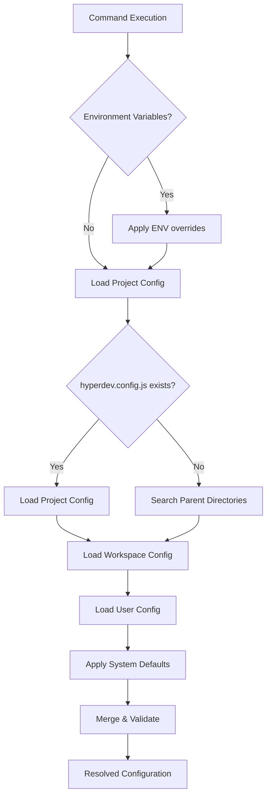

# HyperDev Configuration Guide

HyperDev provides a comprehensive configuration system that manages everything from project-wide settings to individual template behaviors. This guide covers all configuration levels, formats, and advanced features to help you create the ideal development environment.

## Configuration Hierarchy

HyperDev uses a hierarchical configuration system that resolves settings in the following order (highest to lowest priority):

<Steps>
  <Step title="Runtime & Environment">
    Environment variables and command-line flags override all other settings
  </Step>
  <Step title="Project Configuration">
    Project-specific settings in your repository root
  </Step>
  <Step title="Workspace Configuration">
    Moon workspace settings for monorepo management
  </Step>
  <Step title="User Configuration">
    Personal settings in your home directory
  </Step>
  <Step title="System Defaults">
    Built-in defaults and global system settings
  </Step>
</Steps>

### Configuration Resolution Flow



## Project Configuration

### Hypergen Configuration

The primary configuration file for HyperDev projects is `hyperdev.config.js`:

<CodeGroup>

```javascript hyperdev.config.js
/**
 * Hypergen Configuration
 * @type {import('hyperdev').HyperdevConfig}
 */
export default {
  // Template Discovery
  templates: ['recipes', 'cookbooks'],
  
  discovery: {
    sources: ['local', 'npm', 'workspace', 'github'],
    directories: ['recipes', 'cookbooks', '_templates'],
    exclude: ['node_modules', '.git', 'dist', 'build']
  },
  
  // Template Engine
  engine: {
    type: 'ejs',
    options: {
      delimiter: '%',
      openDelimiter: '<',
      closeDelimiter: '>'
    }
  },
  
  // File Operations
  output: {
    conflictStrategy: 'fail', // fail | overwrite | skip | merge
    createDirectories: true,
    preserveTimestamps: false,
    backupOriginals: false
  },
  
  // Validation & Safety
  validation: {
    strict: true,
    validateTemplates: true,
    validateVariables: true,
    requireExplicitOverwrites: true
  },
  
  // Performance & Caching
  cache: {
    enabled: true,
    directory: '.hyperdev-cache',
    ttl: 3600000, // 1 hour
    strategy: 'memory-disk' // memory | disk | memory-disk
  },
  
  // Extensions
  plugins: [
    '@hyperdev/plugin-typescript',
    '@hyperdev/plugin-react',
    './custom-plugins/my-plugin.js'
  ],
  
  // Custom Helpers
  helpers: './src/helpers/template-helpers.js',
  
  // Environment-specific overrides
  environments: {
    development: {
      validation: { strict: false },
      cache: { enabled: false }
    },
    staging: {
      output: { conflictStrategy: 'skip' }
    },
    production: {
      cache: { ttl: 86400000 }, // 24 hours
      validation: { strict: true }
    }
  },
  
  // Security Settings
  security: {
    allowRemoteTemplates: true,
    trustedSources: [
      'https://github.com/hyperdev-ai',
      'npm:@hyperdev/*'
    ],
    sandboxMode: false
  },
  
  // Advanced Features
  features: {
    experimentalActions: true,
    parallelGeneration: true,
    interactiveMode: true,
    aiAssistance: true
  }
}
```

```json hyperdev.config.json
{
  "$schema": "https://hyperdev.ai/schemas/config.json",
  "templates": ["recipes"],
  "discovery": {
    "sources": ["local", "npm"],
    "directories": ["recipes", "_templates"]
  },
  "engine": {
    "type": "ejs"
  },
  "output": {
    "conflictStrategy": "fail"
  },
  "cache": {
    "enabled": true
  }
}
```

</CodeGroup>

### Configuration File Locations

HyperDev searches for configuration files in the following locations:

<Accordion title="Configuration File Search Order">
  1. **Explicit path**: `--config path/to/config.js`
  2. **Environment variable**: `HYPERDEV_CONFIG=path/to/config.js`
  3. **Project root** (current directory):
     - `hyperdev.config.js`
     - `hyperdev.config.mjs` 
     - `hyperdev.config.cjs`
     - `hyperdev.config.json`
     - `.hyperdevrc`
     - `.hyperdevrc.js`
     - `.hyperdevrc.json`
  4. **Parent directories**: Walks up the directory tree
  5. **Home directory**: `~/.hyperdevrc` or `~/.config/hyperdev.config.js`
  6. **System-wide**: `/etc/hyperdev.config.js` (Linux/macOS)
</Accordion>

## Workspace Configuration

For monorepo setups, HyperDev integrates with Moon's workspace configuration:

<CodeGroup>

```yaml .moon/workspace.yml
$schema: 'https://moonrepo.dev/schemas/workspace.json'

# Extend base configuration
extends: './workspace.base.yml'

# Project discovery
projects:
  - 'packages/*'
  - 'apps/*'

# Workspace-wide settings
workspace:
  inheritedTasks:
    include: ['build', 'test', 'lint']
  dependencyGraph: true
  
# HyperDev integration
hyperdev:
  discovery:
    workspaceRoot: true
    projectTemplates: true
  sharedTemplates: '.hyperdev/shared'
  
# Task definitions
tasks:
  generate:
    command: 'hyper'
    inputs: ['templates/**/*']
    platform: 'node'
```

```yaml .moon/tasks/hyperdev.yml
$schema: "https://moonrepo.dev/schemas/tasks.json"

tasks:
  generate:
    command: 'hyper'
    args: ['$template', '$generator']
    inputs:
      - 'templates/**/*'
      - '_templates/**/*'
      - 'hyperdev.config.js'
    outputs:
      - 'src/**/*'
    options:
      cache: false
      
  template-validate:
    command: 'hyper'
    args: ['validate']
    inputs: ['templates/**/*']
    
  template-build:
    command: 'hyper'
    args: ['build']
    outputs: ['.hyperdev/build/**/*']
```

</CodeGroup>

## Template Configuration

Individual templates can define their own configuration and variables:

<CodeGroup>

```yaml template.yml
name: react-component
description: Generate React components with TypeScript and optional features
version: 2.1.0
author: HyperDev Team
category: frontend
tags: [react, typescript, component]

# Template-specific settings
config:
  engine: ejs
  outputPath: 'src/components'
  conflictStrategy: 'merge'
  
# Variable definitions
variables:
  name:
    type: string
    required: true
    description: Component name (PascalCase)
    pattern: '^[A-Z][a-zA-Z0-9]*$'
    transform: 'pascalCase'
    
  type:
    type: enum
    values: ['functional', 'class', 'forward-ref']
    default: 'functional'
    description: Component implementation type
    
  withStorybook:
    type: boolean
    default: false
    description: Generate Storybook stories
    dependencies: ['@storybook/react']
    
  withTests:
    type: boolean
    default: true
    description: Generate test files
    when: '{{ project.testing.framework }}'
    
  styling:
    type: enum
    values: ['css', 'scss', 'styled-components', 'emotion', 'tailwind']
    default: 'css'
    description: Styling approach
    conditional:
      css: { files: ['{{name}}.module.css'] }
      scss: { files: ['{{name}}.module.scss'] }
      
  props:
    type: array
    items:
      type: object
      properties:
        name: { type: string }
        type: { type: string }
        required: { type: boolean, default: false }
        default: { type: string }
    default: []
    description: Component props interface

# Conditional file generation
files:
  - path: '{{directory}}/{{name}}/{{name}}.tsx'
    template: 'component.tsx.ejs'
    
  - path: '{{directory}}/{{name}}/{{name}}.test.tsx'
    template: 'component.test.tsx.ejs'
    when: '{{withTests}}'
    
  - path: '{{directory}}/{{name}}/{{name}}.stories.tsx'
    template: 'component.stories.tsx.ejs'
    when: '{{withStorybook}}'
    
  - path: '{{directory}}/{{name}}/index.ts'
    template: 'index.ts.ejs'
    
# Post-generation actions
actions:
  - type: 'install'
    packages: ['react', '@types/react']
    when: '{{project.packageManager}}'
    
  - type: 'shell'
    command: 'npm run lint:fix'
    when: '{{project.linting.enabled}}'

# Usage examples
examples:
  - title: 'Basic Button Component'
    description: 'Create a simple reusable button'
    variables:
      name: 'Button'
      type: 'functional'
      withTests: true
      props:
        - { name: 'children', type: 'React.ReactNode', required: true }
        - { name: 'onClick', type: '() => void' }
        - { name: 'variant', type: "'primary' | 'secondary'", default: "'primary'" }
        
  - title: 'Form Input with Storybook'
    description: 'Create an input component with stories'
    variables:
      name: 'TextInput'
      withStorybook: true
      withTests: true
      styling: 'styled-components'
```

```javascript template.config.js
/**
 * Advanced template configuration with dynamic logic
 */
export default {
  async beforeGenerate(context) {
    // Pre-generation setup
    if (context.variables.withStorybook && !context.project.hasStorybook) {
      throw new Error('Storybook not configured in project')
    }
    
    // Dynamic variable modification
    if (context.variables.type === 'class') {
      context.variables.imports = ['Component', 'PureComponent']
    }
  },
  
  async afterGenerate(context, results) {
    // Post-generation cleanup
    console.log(`Generated ${results.files.length} files for ${context.variables.name}`)
    
    // Auto-export in barrel file
    await context.addExport(`./components/index.ts`, context.variables.name)
  },
  
  // Custom validation
  validate: {
    name: (value) => /^[A-Z]/.test(value) || 'Component name must start with uppercase',
    props: (props) => props.length <= 10 || 'Too many props, consider composition'
  },
  
  // Template helpers
  helpers: {
    propType: (prop) => `${prop.name}${prop.required ? '' : '?'}: ${prop.type}`,
    defaultProps: (props) => props.filter(p => p.default).map(p => `${p.name}: ${p.default}`)
  }
}
```

</CodeGroup>

## Environment Configuration

### Environment Variables

Override any configuration setting using environment variables:

```bash
# Template discovery
export HYPERDEV_TEMPLATES="./my-templates,./shared-templates"
export HYPERDEV_DISCOVERY_SOURCES="local,npm"

# Engine settings
export HYPERDEV_ENGINE_TYPE="handlebars"
export HYPERDEV_CONFLICT_STRATEGY="merge"

# Performance
export HYPERDEV_CACHE_ENABLED="true"
export HYPERDEV_CACHE_TTL="7200000"

# Security
export HYPERDEV_ALLOW_REMOTE="false"
export HYPERDEV_TRUSTED_SOURCES="npm:@myorg/*,github:myorg/*"

# Development
export NODE_ENV="development"
export HYPERDEV_DEBUG="true"
export HYPERDEV_VERBOSE="true"
```

### Conditional Configuration

Create environment-specific configurations:

<CodeGroup>

```javascript hyperdev.config.js
export default {
  // Base configuration
  templates: ['recipes'],
  
  // Environment-specific overrides
  environments: {
    development: {
      validation: { strict: false },
      cache: { enabled: false },
      output: { conflictStrategy: 'overwrite' },
      features: { experimentalActions: true }
    },
    
    test: {
      templates: ['recipes', 'test-fixtures'],
      output: { 
        conflictStrategy: 'skip',
        createDirectories: true
      },
      cache: { enabled: false }
    },
    
    staging: {
      validation: { strict: true },
      output: { 
        conflictStrategy: 'fail',
        backupOriginals: true 
      },
      security: { allowRemoteTemplates: false }
    },
    
    production: {
      validation: { strict: true },
      cache: { 
        enabled: true,
        ttl: 86400000 // 24 hours
      },
      security: { 
        allowRemoteTemplates: false,
        sandboxMode: true 
      }
    }
  }
}
```

```javascript config/hyperdev.prod.js
// Production-specific configuration
export default {
  templates: ['production-recipes'],
  
  discovery: {
    sources: ['local'], // Only local templates in production
    exclude: ['**/test/**', '**/*.dev.*']
  },
  
  validation: {
    strict: true,
    validateTemplates: true,
    requireExplicitOverwrites: true
  },
  
  security: {
    allowRemoteTemplates: false,
    sandboxMode: true,
    trustedSources: [] // No remote sources
  },
  
  cache: {
    enabled: true,
    ttl: 86400000, // 24 hours
    strategy: 'disk'
  }
}
```

</CodeGroup>

## User Configuration

### Global User Settings

Create personal defaults in your home directory:

<CodeGroup>

```javascript ~/.hyperdevrc.js
// Global user configuration
export default {
  // Personal template preferences
  discovery: {
    directories: ['~/templates', '~/.hyperdev/templates']
  },
  
  // Default author info
  defaults: {
    author: 'John Doe',
    email: 'john@example.com',
    license: 'MIT'
  },
  
  // Personal helpers
  helpers: '~/.hyperdev/helpers.js',
  
  // UI preferences
  ui: {
    theme: 'dark',
    interactive: true,
    confirmOverwrites: true
  },
  
  // AI assistance
  ai: {
    provider: 'openai',
    model: 'gpt-4',
    apiKey: process.env.OPENAI_API_KEY
  }
}
```

```json ~/.config/hyperdev.config.json
{
  "defaults": {
    "author": "John Doe",
    "license": "MIT"
  },
  "ui": {
    "theme": "dark",
    "interactive": true
  },
  "discovery": {
    "directories": ["~/templates"]
  }
}
```

</CodeGroup>

## Advanced Configuration Features

### Plugin System

Extend HyperDev functionality with plugins:

<CodeGroup>

```javascript plugins/typescript-plugin.js
export default {
  name: 'typescript-plugin',
  version: '1.0.0',
  
  // Plugin hooks
  async beforeGenerate(context) {
    // Ensure TypeScript is configured
    if (!context.project.hasTypeScript) {
      await context.installPackages(['typescript', '@types/node'])
      await context.generateFile('tsconfig.json', this.templates.tsconfig)
    }
  },
  
  // Custom variables
  variables: {
    strict: { type: 'boolean', default: true },
    target: { type: 'string', default: 'ES2020' }
  },
  
  // Template helpers
  helpers: {
    typeAnnotation: (type) => `: ${type}`,
    interfaceName: (name) => `I${name}`
  }
}
```

```javascript hyperdev.config.js
export default {
  plugins: [
    // Built-in plugins
    '@hyperdev/plugin-typescript',
    '@hyperdev/plugin-react',
    '@hyperdev/plugin-testing',
    
    // Local plugins
    './plugins/custom-plugin.js',
    
    // Plugin with options
    {
      plugin: '@hyperdev/plugin-database',
      options: {
        provider: 'postgresql',
        migrations: true
      }
    }
  ]
}
```

</CodeGroup>

### Configuration Validation

HyperDev provides built-in configuration validation:

```javascript
import { validateConfig } from 'hyperdev'

// Validate configuration
const config = { /* your config */ }
const validation = validateConfig(config)

if (!validation.valid) {
  console.error('Configuration errors:')
  validation.errors.forEach(error => console.error(`- ${error}`))
  process.exit(1)
}
```

### Configuration Schema

Use JSON Schema for IDE support and validation:

```json package.json
{
  "scripts": {
    "config:validate": "hyper validate-config",
    "config:init": "hyper init-config --interactive"
  }
}
```

## Configuration Management Tools

### Interactive Setup Wizard

Initialize configuration interactively:

```bash
# Create new configuration
hyper init --interactive

# Upgrade existing configuration
hyper config upgrade

# Validate current configuration
hyper config validate

# Show resolved configuration
hyper config show
```

### Configuration Templates

Generate configuration for common scenarios:

<Tabs>
  <Tab title="Frontend Project">
    ```bash
    hyper init --template=react-app
    hyper init --template=vue-app
    hyper init --template=angular-app
    ```
  </Tab>
  <Tab title="Backend Project">
    ```bash
    hyper init --template=node-api
    hyper init --template=fastify-api
    hyper init --template=express-app
    ```
  </Tab>
  <Tab title="Full-Stack">
    ```bash
    hyper init --template=next-app
    hyper init --template=nuxt-app
    hyper init --template=t3-stack
    ```
  </Tab>
</Tabs>

## Configuration Best Practices

### Security Guidelines

<Warning>
Always validate and sanitize configuration from external sources:

```javascript
// ✅ Good - Validate remote configuration
const config = await loadRemoteConfig(url)
const validation = validateConfig(config)
if (!validation.valid) {
  throw new Error(`Invalid configuration: ${validation.errors.join(', ')}`)
}

// ❌ Bad - Trust external configuration blindly
const config = await loadRemoteConfig(url)
await applyConfig(config) // Potential security risk
```
</Warning>

### Performance Optimization

<Tip>
Optimize configuration for better performance:

```javascript
export default {
  // Enable caching for better performance
  cache: {
    enabled: true,
    strategy: 'memory-disk',
    ttl: 3600000
  },
  
  // Parallel template processing
  features: {
    parallelGeneration: true
  },
  
  // Exclude unnecessary directories
  discovery: {
    exclude: [
      'node_modules/**',
      '**/.git/**',
      '**/dist/**',
      '**/coverage/**'
    ]
  }
}
```
</Tip>

### Maintainable Configuration

<Accordion title="Configuration Organization Tips">
  1. **Split large configurations**: Use multiple files and merge them
  2. **Use environment-specific files**: `config/dev.js`, `config/prod.js`
  3. **Document your settings**: Add comments explaining complex configurations
  4. **Version your configuration**: Track configuration changes in git
  5. **Validate on CI**: Add configuration validation to your build process
</Accordion>

## Migration and Compatibility

### Configuration Migration

Upgrade configurations between versions:

```bash
# Migrate from v1 to v2 configuration format
hyper migrate --from=1.0 --to=2.0

# Show migration preview
hyper migrate --dry-run

# Backup before migration
hyper migrate --backup
```

### Backward Compatibility

HyperDev maintains compatibility with older configuration formats:

```javascript
// Legacy configuration (still supported)
export default {
  templates: './templates',
  helpers: './helpers.js'
}

// Modern configuration (recommended)
export default {
  discovery: {
    directories: ['./templates']
  },
  helpers: './helpers.js'
}
```

## Troubleshooting Configuration

### Common Issues

<AccordionGroup>
  <Accordion title="Configuration Not Found">
    **Problem**: HyperDev can't find your configuration file
    
    **Solutions**:
    - Check file name spelling: `hyperdev.config.js` (not `hyperdev.config.ts`)
    - Ensure file is in project root or parent directory
    - Use absolute path with `--config` flag
    - Verify file permissions are readable
  </Accordion>
  
  <Accordion title="Invalid Configuration Format">
    **Problem**: Configuration file has syntax errors
    
    **Solutions**:
    - Validate JSON syntax with `hyper config validate`
    - Check JavaScript syntax with `node -c hyperdev.config.js`
    - Use IDE with schema validation
    - Start with minimal configuration and build up
  </Accordion>
  
  <Accordion title="Environment Override Not Working">
    **Problem**: Environment variables aren't overriding config
    
    **Solutions**:
    - Check variable naming: `HYPERDEV_CACHE_ENABLED` not `CACHE_ENABLED`
    - Verify environment is correctly detected: `NODE_ENV=production`
    - Use `hyper config show` to see resolved configuration
    - Ensure environment config exists in `environments` object
  </Accordion>
</AccordionGroup>

### Debug Configuration

Enable debug mode to troubleshoot configuration issues:

```bash
# Debug configuration loading
DEBUG=hyperdev:config hyper gen

# Show resolved configuration
hyper config show --verbose

# Validate configuration
hyper config validate --strict
```

This comprehensive configuration guide should help you set up and manage HyperDev configurations effectively across all levels of your development workflow.