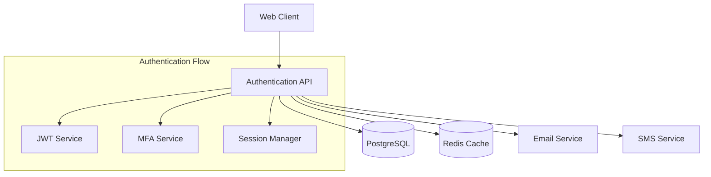

import { Aside } from '@astrojs/starlight/components';

<Aside type="note">
  This is an architecture reference. For usage docs, see [hyper plan](/reference/commands/plan).
</Aside>

## Epic Directory Structure

When you create an epic, HyperDev generates the following tree under `.hyper/epics/<name>/`:

```
.hyper/epics/user-authentication/
├── epic.yml                    # Epic metadata and configuration
├── prd.md                      # Product Requirements Document
├── technical-spec.md           # Technical specification
├── architecture/
│   ├── system-diagram.mmd      # Mermaid system diagram
│   ├── database-schema.sql     # Database design
│   └── api-spec.yml           # API specification
├── tasks/
│   ├── tasks.yml              # Task breakdown
│   └── roadmap.md             # Implementation roadmap
├── tests/
│   ├── acceptance-criteria.md  # Acceptance tests
│   └── test-strategy.md       # Testing approach
└── docs/
    ├── user-guide.md          # User documentation
    └── developer-guide.md     # Developer documentation
```

## epic.yml Schema

```yaml
name: "User Authentication System"
version: "1.0.0"
status: "planning"          # planning | active | done | archived
priority: "high"            # low | medium | high | critical

description: |
  Complete user authentication system with registration, login,
  password reset, and multi-factor authentication support.

scope:
  includes:
    - User registration and login
    - Password reset functionality
    - Multi-factor authentication
    - Session management
    - Role-based permissions
  excludes:
    - Social media login (future phase)
    - Single sign-on (separate epic)

stakeholders:
  owner: "jane.smith@company.com"
  developers: ["john.doe@company.com"]
  reviewers: ["tech.lead@company.com"]

timeline:
  start: "2024-02-01"
  end: "2024-03-15"
  milestones:
    - name: "Core auth implementation"
      date: "2024-02-15"
    - name: "MFA implementation"
      date: "2024-03-01"
    - name: "Testing and documentation"
      date: "2024-03-15"

architecture:
  patterns: ["JWT", "RBAC", "REST"]
  technologies: ["Node.js", "Express", "PostgreSQL", "Redis"]
  integrations: ["SendGrid", "Twilio"]
```

## Epic Templates

| Template | Description | Use Case |
|----------|-------------|----------|
| `saas-feature` | SaaS product feature | User-facing features with auth, billing, etc. |
| `api-service` | Backend API service | Microservices, REST APIs, GraphQL |
| `ui-component` | UI component library | Design system components |
| `integration` | Third-party integration | External service integrations |
| `migration` | Data/system migration | Database migrations, system upgrades |
| `performance` | Performance optimization | Speed, scalability improvements |
| `security` | Security implementation | Auth, encryption, compliance |
| `infrastructure` | Infrastructure setup | DevOps, CI/CD, monitoring |

## PRD Template Structure

Generated `prd.md` follows this structure:

```markdown
# {Epic Name} - Product Requirements Document

## Problem Statement
{Current situation and the gap being addressed}

## Goals and Success Metrics
- {Measurable goal 1}
- {Measurable goal 2}

## User Stories
### {Persona 1} Flow
As a {persona}, I want to:
- {Story 1}
- {Story 2}

## Technical Requirements
### Functional Requirements
- {Requirement 1}

### Non-Functional Requirements
- {Uptime, performance, compliance requirements}

## Implementation Phases
### Phase 1: {Name} ({duration})
- {Item 1}

### Phase 2: {Name} ({duration})
- {Item 1}

## Success Criteria
- All user stories completed and tested
- Performance benchmarks met
- Security audit passed
```

## Task Breakdown YAML Schema

Generated `tasks/tasks.yml`:

```yaml
epic: "User Authentication System"
tasks:
  - id: "AUTH-001"
    title: "Set up authentication database schema"
    description: "Create users, sessions, and related tables"
    priority: "high"
    estimate: "2 days"
    dependencies: []

  - id: "AUTH-002"
    title: "Implement user registration API"
    description: "POST /auth/register endpoint with validation"
    priority: "high"
    estimate: "3 days"
    dependencies: ["AUTH-001"]

  - id: "AUTH-003"
    title: "Implement login/logout API"
    description: "Authentication endpoints with JWT tokens"
    priority: "high"
    estimate: "3 days"
    dependencies: ["AUTH-001", "AUTH-002"]
```

## Architecture Diagram Generation

```bash
# Diagram types
hyper plan auth-system --arch --diagram system     # Component graph
hyper plan auth-system --arch --diagram database   # DB schema diagram
hyper plan auth-system --arch --diagram api-flow   # API flow diagram
```

Diagrams are emitted as Mermaid source (`.mmd` files). Example output:



## Export and Project Management Integration

```bash
# Documentation export
hyper plan auth-system --export all --format pdf
hyper plan auth-system --export prd --format markdown
hyper plan auth-system --export architecture --format png
hyper plan auth-system --export tasks --format csv

# Project management tool export
hyper plan auth-system --export jira --project AUTH
hyper plan auth-system --export linear --team engineering
hyper plan auth-system --export github --repo company/product
```

## Planning Dashboard Features

Launched via `hyper plan --dashboard`:

1. **Epic Overview** — Status, progress, and health metrics
2. **Architecture Viewer** — Interactive diagrams and specifications
3. **Task Kanban** — Drag-and-drop task management
4. **Timeline View** — Gantt charts and milestone tracking
5. **Documentation Hub** — Centralized docs and specs
6. **Collaboration Tools** — Comments, reviews, and approvals

Dashboard supports real-time collaboration (multiple team members), AI architectural suggestions, and direct integration with `hyper gen`.

## Configuration Block

```javascript
// hypergen.config.js
export default {
  planning: {
    defaultTemplate: 'saas-feature',

    aiGuidance: {
      architecture: true,
      taskBreakdown: true,
      riskAssessment: true,
      bestPractices: true
    },

    documentation: {
      autoGenerate: ['prd', 'technical-spec'],
      exportFormats: ['pdf', 'markdown'],
      templates: './epic-templates'
    },

    integrations: {
      jira: {
        url: 'https://company.atlassian.net',
        project: 'PROJ'
      },
      linear: {
        team: 'engineering'
      },
      github: {
        repo: 'company/product',
        labels: ['epic', 'feature']
      }
    }
  }
}
```
