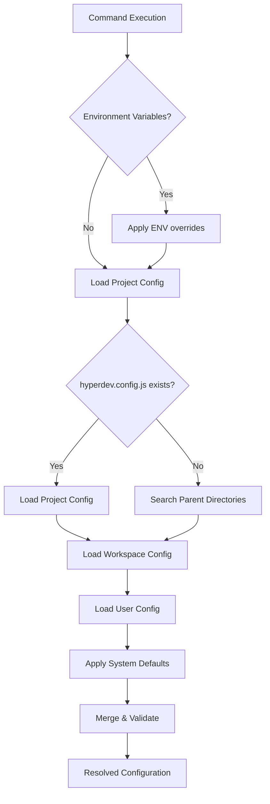

import { Aside } from '@astrojs/starlight/components';

<Aside type="note">
  This is an architecture reference. For usage docs, see the [configuration guide](/reference/configuration).
</Aside>

## Configuration Resolution Flow



## Configuration File Search Order

HyperDev searches for config in this order:

1. `--config path/to/config.js` (explicit flag)
2. `HYPERDEV_CONFIG=path/to/config.js` (environment variable)
3. Project root (current directory):
   - `hyperdev.config.js`
   - `hyperdev.config.mjs`
   - `hyperdev.config.cjs`
   - `hyperdev.config.json`
   - `.hyperdevrc`
   - `.hyperdevrc.js`
   - `.hyperdevrc.json`
4. Parent directories (walks up)
5. Home directory: `~/.hyperdevrc` or `~/.config/hyperdev.config.js`
6. System-wide: `/etc/hyperdev.config.js` (Linux/macOS)

## Full hyperdev.config.js Schema

```javascript
// hyperdev.config.js
export default {
  // Template Discovery
  templates: ['recipes', 'cookbooks'],

  discovery: {
    sources: ['local', 'npm', 'workspace', 'github'],
    directories: ['recipes', 'cookbooks', '_templates'],
    exclude: ['node_modules', '.git', 'dist', 'build']
  },

  // Template Engine
  engine: {
    type: 'ejs',              // 'ejs' | 'handlebars' | 'jig'
    options: {
      delimiter: '%',
      openDelimiter: '<',
      closeDelimiter: '>'
    }
  },

  // File Operations
  output: {
    conflictStrategy: 'fail', // 'fail' | 'overwrite' | 'skip' | 'merge'
    createDirectories: true,
    preserveTimestamps: false,
    backupOriginals: false
  },

  // Validation & Safety
  validation: {
    strict: true,
    validateTemplates: true,
    validateVariables: true,
    requireExplicitOverwrites: true
  },

  // Performance & Caching
  cache: {
    enabled: true,
    directory: '.hyperdev-cache',
    ttl: 3600000,             // milliseconds (1 hour default)
    strategy: 'memory-disk'   // 'memory' | 'disk' | 'memory-disk'
  },

  // Extensions
  plugins: [
    '@hyperdev/plugin-typescript',
    '@hyperdev/plugin-react',
    './custom-plugins/my-plugin.js',
    // Plugin with options:
    {
      plugin: '@hyperdev/plugin-database',
      options: {
        provider: 'postgresql',
        migrations: true
      }
    }
  ],

  // Custom Helpers
  helpers: './src/helpers/template-helpers.js',

  // Environment-specific overrides
  environments: {
    development: {
      validation: { strict: false },
      cache: { enabled: false },
      output: { conflictStrategy: 'overwrite' },
      features: { experimentalActions: true }
    },
    test: {
      templates: ['recipes', 'test-fixtures'],
      output: {
        conflictStrategy: 'skip',
        createDirectories: true
      },
      cache: { enabled: false }
    },
    staging: {
      validation: { strict: true },
      output: {
        conflictStrategy: 'fail',
        backupOriginals: true
      },
      security: { allowRemoteTemplates: false }
    },
    production: {
      validation: { strict: true },
      cache: {
        enabled: true,
        ttl: 86400000  // 24 hours
      },
      security: {
        allowRemoteTemplates: false,
        sandboxMode: true
      }
    }
  },

  // Security Settings
  security: {
    allowRemoteTemplates: true,
    trustedSources: [
      'https://github.com/hyperdev-ai',
      'npm:@hyperdev/*'
    ],
    sandboxMode: false
  },

  // Feature Flags
  features: {
    experimentalActions: true,
    parallelGeneration: true,
    interactiveMode: true,
    aiAssistance: true
  }
}
```

## Template-Level Configuration (template.yml)

```yaml
name: react-component
description: Generate React components with TypeScript and optional features
version: 2.1.0
author: HyperDev Team
category: frontend
tags: [react, typescript, component]

config:
  engine: ejs
  outputPath: 'src/components'
  conflictStrategy: 'merge'

variables:
  name:
    type: string
    required: true
    description: Component name (PascalCase)
    pattern: '^[A-Z][a-zA-Z0-9]*$'
    transform: 'pascalCase'

  type:
    type: enum
    values: ['functional', 'class', 'forward-ref']
    default: 'functional'

  withStorybook:
    type: boolean
    default: false
    dependencies: ['@storybook/react']

  withTests:
    type: boolean
    default: true
    when: '{{ project.testing.framework }}'

  styling:
    type: enum
    values: ['css', 'scss', 'styled-components', 'emotion', 'tailwind']
    default: 'css'
    conditional:
      css: { files: ['{{name}}.module.css'] }
      scss: { files: ['{{name}}.module.scss'] }

  props:
    type: array
    items:
      type: object
      properties:
        name: { type: string }
        type: { type: string }
        required: { type: boolean, default: false }
        default: { type: string }
    default: []

files:
  - path: '{{directory}}/{{name}}/{{name}}.tsx'
    template: 'component.tsx.ejs'

  - path: '{{directory}}/{{name}}/{{name}}.test.tsx'
    template: 'component.test.tsx.ejs'
    when: '{{withTests}}'

  - path: '{{directory}}/{{name}}/{{name}}.stories.tsx'
    template: 'component.stories.tsx.ejs'
    when: '{{withStorybook}}'

  - path: '{{directory}}/{{name}}/index.ts'
    template: 'index.ts.ejs'

actions:
  - type: 'install'
    packages: ['react', '@types/react']
    when: '{{project.packageManager}}'

  - type: 'shell'
    command: 'npm run lint:fix'
    when: '{{project.linting.enabled}}'
```

## Moon Workspace Integration

```yaml
# .moon/workspace.yml
$schema: 'https://moonrepo.dev/schemas/workspace.json'

projects:
  - 'packages/*'
  - 'apps/*'

hyperdev:
  discovery:
    workspaceRoot: true
    projectTemplates: true
  sharedTemplates: '.hyperdev/shared'

tasks:
  generate:
    command: 'hyper'
    inputs: ['templates/**/*']
    platform: 'node'
```

## Environment Variables Reference

```bash
# Template discovery
export HYPERDEV_TEMPLATES="./my-templates,./shared-templates"
export HYPERDEV_DISCOVERY_SOURCES="local,npm"

# Engine settings
export HYPERDEV_ENGINE_TYPE="handlebars"
export HYPERDEV_CONFLICT_STRATEGY="merge"

# Performance
export HYPERDEV_CACHE_ENABLED="true"
export HYPERDEV_CACHE_TTL="7200000"

# Security
export HYPERDEV_ALLOW_REMOTE="false"
export HYPERDEV_TRUSTED_SOURCES="npm:@myorg/*,github:myorg/*"

# Debug
export NODE_ENV="development"
export HYPERDEV_DEBUG="true"
export HYPERDEV_VERBOSE="true"
```

## Plugin Development API

```javascript
// plugins/typescript-plugin.js
export default {
  name: 'typescript-plugin',
  version: '1.0.0',

  async beforeGenerate(context) {
    if (!context.project.hasTypeScript) {
      await context.installPackages(['typescript', '@types/node'])
      await context.generateFile('tsconfig.json', this.templates.tsconfig)
    }

    if (context.variables.type === 'class') {
      context.variables.imports = ['Component', 'PureComponent']
    }
  },

  async afterGenerate(context, results) {
    await context.addExport(`./components/index.ts`, context.variables.name)
  },

  variables: {
    strict: { type: 'boolean', default: true },
    target: { type: 'string', default: 'ES2020' }
  },

  helpers: {
    typeAnnotation: (type) => `: ${type}`,
    interfaceName: (name) => `I${name}`
  }
}
```

## Validation API

```javascript
import { validateConfig } from 'hyperdev'

const config = { /* your config */ }
const validation = validateConfig(config)

if (!validation.valid) {
  console.error('Configuration errors:')
  validation.errors.forEach(error => console.error(`- ${error}`))
  process.exit(1)
}
```

```bash
# CLI validation
hyper config validate
hyper config validate --strict
hyper config show --verbose
DEBUG=hyperdev:config hyper gen
```

## User Configuration File

```javascript
// ~/.hyperdevrc.js
export default {
  discovery: {
    directories: ['~/templates', '~/.hyperdev/templates']
  },
  defaults: {
    author: 'John Doe',
    email: 'john@example.com',
    license: 'MIT'
  },
  helpers: '~/.hyperdev/helpers.js',
  ui: {
    theme: 'dark',
    interactive: true,
    confirmOverwrites: true
  },
  ai: {
    provider: 'openai',
    model: 'gpt-4',
    apiKey: process.env.OPENAI_API_KEY
  }
}
```

## Migration Between Config Versions

```bash
# Migrate config format
hyper migrate --from=1.0 --to=2.0
hyper migrate --dry-run
hyper migrate --backup
```

Legacy config (still supported):

```javascript
// v1 format
export default {
  templates: './templates',
  helpers: './helpers.js'
}

// v2 format (recommended)
export default {
  discovery: {
    directories: ['./templates']
  },
  helpers: './helpers.js'
}
```
