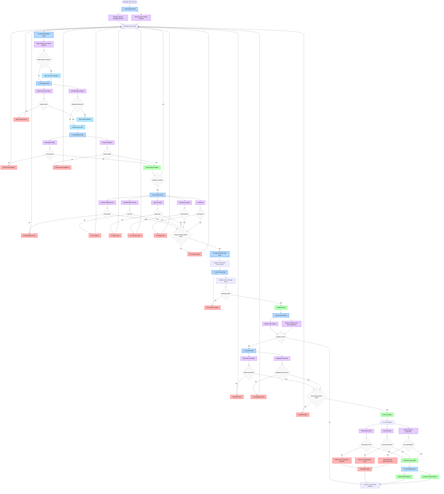

import { Aside } from '@astrojs/starlight/components';

<Aside type="caution" title="Spec Document — Coming Soon">
This page describes a **planned feature** that hasn't been implemented yet. It serves as a living specification under [Docs-Driven Development](https://github.com/svallory/hyper-coding/discussions). Feedback welcome!
</Aside>

# Claude Code Hooks & Quality Control

This guide walks through building quality control gates with Claude Code hooks and Git hooks together. The goal is a development workflow that catches problems early — ideally before you've written three more files on top of a bad assumption.

## Available Hooks

### Claude Code Hooks
- **PreToolUse**: Runs before any tool execution (validation, permission checks)
- **PostToolUse**: Executes after successful tool completion
- **UserPromptSubmit**: Triggered when user submits a prompt
- **Notification**: Runs during specific notification events
- **Stop/SubagentStop**: Executes when agent/subagent finishes responding
- **SessionStart/SessionEnd**: Manages session initialization/cleanup
- **PreCompact**: Runs before context compaction

### Git Hooks
- **pre-commit**: Before commit is created
- **prepare-commit-msg**: Before commit message editor
- **commit-msg**: After commit message is written
- **post-commit**: After commit is completed
- **pre-push**: Before push to remote
- **post-receive**: After push is received (server-side)

## Quality Control Integration Flow



## Hook Configuration Examples

### Claude Code Hooks Configuration

```json
{
  "hooks": {
    "SessionStart": [
      {
        "command": "./scripts/init-intrusive-thoughts.sh",
        "description": "Initialize background pattern daemon"
      }
    ],
    "PreToolUse": [
      {
        "matcher": "Write.*function|class|component",
        "command": "./scripts/check-duplicates.sh",
        "description": "Check for similar code patterns",
        "timeout": 2000
      },
      {
        "matcher": ".*",
        "command": "./scripts/syntax-check.sh",
        "description": "Real-time syntax validation"
      }
    ],
    "PostToolUse": [
      {
        "matcher": "Write|Edit",
        "command": "./scripts/immediate-lint.sh",
        "description": "Immediate linting feedback"
      }
    ],
    "UserPromptSubmit": [
      {
        "command": "./scripts/inject-context.sh",
        "description": "Add peripheral awareness context"
      }
    ]
  }
}
```

### Git Hooks Configuration

```bash
#!/usr/bin/env bash
# .git/hooks/pre-commit

set -e

echo "🔍 Running pre-commit quality gates..."

# Format check
echo "📝 Checking code formatting..."
bun run format:check

# Linting
echo "🔍 Running linters..."
bun run lint

# Type checking
echo "🔧 Type checking..."
bun run typecheck

# Security scan
echo "🔒 Security scanning..."
bun run security:scan

# Unit tests
echo "🧪 Running tests..."
bun run test

echo "✅ All pre-commit checks passed!"
```

## Peripheral Awareness Implementation

### Background Daemon for Intrusive Thoughts

The "intrusive thoughts" system is how we give AI agents something like peripheral awareness. While Claude works on a task, a background daemon scans the codebase for similar patterns and injects that context before decisions get made. The idea is to catch "I'll just create a new service for this" moments before they happen.

#### Key Use Cases

1. **Utility Function Duplication**
   - Detection: AST analysis + semantic embeddings
   - Example: New `formatCurrency()` vs existing `formatMoney()`
   - Impact: High - prevents common duplications

2. **API Endpoint Patterns**
   - Detection: Route pattern analysis + HTTP method consistency
   - Example: New `POST /user-profile` vs existing `POST /users/profile`
   - Impact: Medium - improves API consistency

3. **Component Naming Consistency**
   - Detection: Edit distance + project convention learning
   - Example: New `user_card.tsx` in project using `UserCard.tsx` pattern
   - Impact: High - maintains design system consistency

4. **Dependency Management**
   - Detection: Functionality category matching
   - Example: Adding `moment` when `date-fns` already exists
   - Impact: Medium - prevents bundle bloat

#### Implementation Strategy

```bash
#!/usr/bin/env bash
# scripts/inject-context.sh

# Query background daemon for similar patterns
SIMILAR_PATTERNS=$(curl -s "http://localhost:8080/api/similar" \
  -H "Content-Type: application/json" \
  -d "{\"action\": \"$CLAUDE_TOOL_NAME\", \"content\": \"$CLAUDE_TOOL_ARGS\"}")

if [ -n "$SIMILAR_PATTERNS" ]; then
  echo "💭 Intrusive thought: $SIMILAR_PATTERNS"
  export CLAUDE_CONTEXT_INJECTION="$SIMILAR_PATTERNS"
fi
```

### Similarity Detection Methods

- **Function signatures**: AST analysis + purpose embeddings
- **Naming patterns**: Edit distance + convention learning
- **Dependencies**: Functionality overlap analysis
- **Architecture patterns**: Structure similarity matching

### Threshold Management

Tuning thresholds is where this gets interesting. Start conservative (high similarity threshold) so the daemon doesn't flood Claude with noise, then dial it down as you learn what's actually useful. Different code types warrant different thresholds; a utility function and an API route aren't the same risk profile. Most importantly, let developers accept or dismiss suggestions — that feedback loop is what makes the system get better over time.

## Quality Control Gate Timing

### Real-Time Gates (Claude Hooks)
- **PreToolUse**: Syntax validation, similarity detection, security checks
- **PostToolUse**: Immediate linting, formatting, basic type checking
- **UserPromptSubmit**: Inject peripheral awareness context before decision-making

### Commit Gates (Git Hooks)
- **pre-commit**: Comprehensive linting, formatting, type checking, security scans
- **commit-msg**: Conventional commit format validation
- **post-commit**: Metrics updates, pattern indexing for future intrusive thoughts

### Push Gates (Git Hooks)
- **pre-push**: Full build verification, integration tests

### Continuous Integration Gates
- **Performance tests**: Automated performance regression detection
- **Security audit**: Deep security analysis
- **Documentation generation**: Automated API docs and guides

## Benefits of Integrated Quality Control

1. **Immediate Feedback**: Real-time quality checks during development
2. **Pattern Recognition**: AI learns project-specific conventions
3. **Duplication Prevention**: Automatic detection of similar code patterns
4. **Consistency Enforcement**: Maintains coding standards across the team
5. **Security First**: Multiple layers of security validation
6. **Performance Optimization**: Prevents performance regressions

## Best Practices

### Hook Performance

Keep hooks fast — anything over 2 seconds breaks the flow. For expensive operations (AST analysis, semantic embeddings), offload to the background daemon and return quickly. Cache similarity results aggressively; the codebase doesn't change on every keystroke.

### Context Management

More context isn't always better. If the daemon fires on every single action, developers start ignoring it — same as any noisy alert system. Score relevance, learn what developers actually act on, and prune low-signal suggestions. The goal is useful interruptions, not a stream of noise.

### Team Adoption

Start conservative and earn trust before tightening things up. Give developers an easy override path for false positives (and track which overrides recur — those are miscalibrated thresholds). Report quality improvements back to the team; people are more patient with automation when they can see it working.

## Future Enhancements

### ML Pattern Recognition
- Learn project-specific patterns over time
- Identify team coding preferences
- Suggest architectural improvements

### Team Knowledge Sharing
- Cross-developer pattern sharing
- Cross-project similarity detection
- Knowledge preservation when developers leave

### Predictive Assistance
- "You usually add error handling to network calls"
- "This pattern typically needs unit tests"
- "Similar components usually have loading states"

The integrated approach builds a quality system that gets smarter with use — immediate feedback now, institutional knowledge over time.

## Complete Scenario: Adding User Profile Analytics

The concepts above come together in a realistic end-to-end example: adding a user analytics dashboard where intrusive thoughts prevent duplication, enforce naming conventions, and promote code reuse at every step. The scenario traces all 11 hook activations and shows how reactive context changes the agent's behavior mid-task.

For a complete walkthrough of how these hooks work in practice, see the [User Analytics Dashboard Scenario](/docs/examples/user-analytics-scenario).
