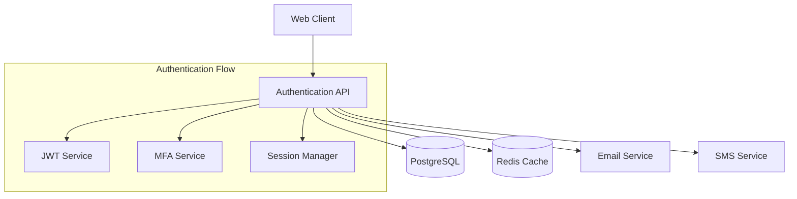

import { CardGrid, Card } from '@astrojs/starlight/components';

# hyper plan

Break down complex features into concrete, implementable plans --- with AI-generated technical specs and architecture guidance baked in.

## Syntax

```bash
hyper plan [plan-title] [options]
```

## Overview

When you run `hyper plan`, you get an interactive session that walks you through scoping a feature or epic. It asks about your goals, stack, constraints, and timeline, then generates a structured set of artifacts: a PRD, a technical spec, a database/API design, and a task breakdown ready to hand off to `hyper gen`. You can stop at any layer---just need the task list? Exit after the breakdown. Want the full architecture? Keep going.

The session is conversational but structured. You're not free-forming a chat; you're filling in a plan template with AI help. That keeps the output consistent and makes it composable with the rest of the toolchain.

Key capabilities:

- **Architecture design**: Generate technical specifications and system diagrams
- **Task breakdown**: Break complex features into implementable tasks
- **Technical documentation**: Auto-generate PRDs, architecture docs, and specs
- **AI-powered insights**: Get architectural guidance and best practice recommendations

## Options

| Option | Description | Default | Example |
|--------|-------------|---------|---------|
| `--template <name>` | Plan document template to use | `standard` | `--template technical-prd` |
| `--from <document>` | Initialize with existing document | - | `--from requirements.md` |

## Examples

### Basic Planning

```bash
# Start interactive planning session
hyper plan

# Launch planning dashboard
hyper plan --dashboard

# Work on specific epic
hyper plan user-authentication
```

### Create New Epic

```bash
# Create epic with wizard
hyper plan create --name "User Authentication System"

# Create from template
hyper plan create --name "Payment System" --template saas-feature

# Create with specific context
hyper plan create --name "Real-time Chat" --context "websocket-based messaging system"
```

### Architecture Design

```bash
# Launch architecture tools
hyper plan --arch

# Generate system diagram
hyper plan auth-system --arch --diagram system

# Export architecture documentation
hyper plan auth-system --arch --export pdf
```

### Task Management

```bash
# Manage epic tasks
hyper plan user-auth --tasks

# Break down epic into tasks
hyper plan user-auth --tasks --breakdown

# Generate implementation roadmap
hyper plan user-auth --tasks --roadmap
```

## Epic Creation

### Epic Templates

Choose from pre-built epic templates:

<details>
<summary>Available Epic Templates</summary>

| Template | Description | Use Case |
|----------|-------------|----------|
| `saas-feature` | SaaS product feature | User-facing features with auth, billing, etc. |
| `api-service` | Backend API service | Microservices, REST APIs, GraphQL |
| `ui-component` | UI component library | Design system components |
| `integration` | Third-party integration | External service integrations |
| `migration` | Data/system migration | Database migrations, system upgrades |
| `performance` | Performance optimization | Speed, scalability improvements |
| `security` | Security implementation | Auth, encryption, compliance |
| `infrastructure` | Infrastructure setup | DevOps, CI/CD, monitoring |

</details>

### Epic Structure

When you create an epic, HyperDev generates:

```
.hyper/epics/user-authentication/
├── epic.yml                    # Epic metadata and configuration
├── prd.md                      # Product Requirements Document
├── technical-spec.md           # Technical specification
├── architecture/
│   ├── system-diagram.mmd      # Mermaid system diagram
│   ├── database-schema.sql     # Database design
│   └── api-spec.yml           # API specification
├── tasks/
│   ├── tasks.yml              # Task breakdown
│   └── roadmap.md             # Implementation roadmap
├── tests/
│   ├── acceptance-criteria.md  # Acceptance tests
│   └── test-strategy.md       # Testing approach
└── docs/
    ├── user-guide.md          # User documentation
    └── developer-guide.md     # Developer documentation
```

### Epic Configuration

**epic.yml**
```yaml
name: "User Authentication System"
version: "1.0.0"
status: "planning"
priority: "high"

description: |
  Complete user authentication system with registration, login, 
  password reset, and multi-factor authentication support.

scope:
  includes:
    - User registration and login
    - Password reset functionality
    - Multi-factor authentication
    - Session management
    - Role-based permissions
  excludes:
    - Social media login (future phase)
    - Single sign-on (separate epic)

stakeholders:
  owner: "jane.smith@company.com"
  developers: ["john.doe@company.com"]
  reviewers: ["tech.lead@company.com"]

timeline:
  start: "2024-02-01"
  end: "2024-03-15"
  milestones:
    - name: "Core auth implementation"
      date: "2024-02-15"
    - name: "MFA implementation"  
      date: "2024-03-01"
    - name: "Testing and documentation"
      date: "2024-03-15"

architecture:
  patterns: ["JWT", "RBAC", "REST"]
  technologies: ["Node.js", "Express", "PostgreSQL", "Redis"]
  integrations: ["SendGrid", "Twilio"]
```

## Architecture Design

### System Diagrams

```bash
# Generate system architecture diagram
hyper plan auth-system --arch --diagram system

# Generate database schema diagram  
hyper plan auth-system --arch --diagram database

# Generate API flow diagram
hyper plan auth-system --arch --diagram api-flow
```

**Example System Diagram** (generated as Mermaid):


### Technical Specifications

HyperDev generates technical specifications covering everything you need to start building:

<details>
<summary>Generated Technical Spec Example</summary>

```markdown
# User Authentication System - Technical Specification

## Architecture
- **Authentication API**: Core endpoints (register, login, logout, reset)
- **JWT Service**: Token generation and validation
- **MFA Service**: TOTP and SMS-based second factor
- **Session Manager**: Session lifecycle with Redis backing

## Database Schema (key tables)
- `users`: id, email, password_hash, role, mfa_enabled
- `sessions`: id, user_id, token_hash, expires_at
- `mfa_tokens`: id, user_id, type, expires_at

## API Endpoints
- `POST /auth/register` → 201 | 400
- `POST /auth/login` → 200 (JWT) | 401
- `POST /auth/logout` → 204
- `POST /auth/reset-password` → 204

## Testing Strategy
- Unit tests for JWT and MFA services
- Integration tests for all auth endpoints
- E2E login/registration flows
```


</details>

## Task Management

### Task Breakdown

```bash
# Auto-generate tasks from epic
hyper plan user-auth --tasks --generate

# Interactive task breakdown
hyper plan user-auth --tasks --breakdown --interactive

# Export tasks for project management
hyper plan user-auth --tasks --export jira
```

**Generated Task Structure**:
```yaml
epic: "User Authentication System"
tasks:
  - id: "AUTH-001"
    title: "Set up authentication database schema"
    description: "Create users, sessions, and related tables"
    priority: "high"
    estimate: "2 days"
    dependencies: []
    
  - id: "AUTH-002"  
    title: "Implement user registration API"
    description: "POST /auth/register endpoint with validation"
    priority: "high"
    estimate: "3 days"
    dependencies: ["AUTH-001"]
    
  - id: "AUTH-003"
    title: "Implement login/logout API"
    description: "Authentication endpoints with JWT tokens"
    priority: "high" 
    estimate: "3 days"
    dependencies: ["AUTH-001", "AUTH-002"]
```

### Implementation Roadmap

HyperDev generates visual roadmaps showing:
- Task dependencies and critical path
- Timeline with milestones
- Resource allocation
- Risk assessment and mitigation

## PRD Management

### Auto-Generated PRDs

```bash
# Generate Product Requirements Document
hyper plan payment-system --prd --generate

# Edit PRD interactively
hyper plan payment-system --prd --edit

# Export PRD for stakeholders
hyper plan payment-system --prd --export pdf
```

**PRD Template Structure**:
```markdown
# Payment System - Product Requirements Document

## Problem Statement
Current checkout process lacks payment flexibility required for enterprise customers.

## Goals
- Support 5+ payment methods
- Achieve PCI DSS compliance

## User Stories
As a customer, I want to choose from multiple payment methods and receive
immediate confirmation.

## Technical Requirements
- Real-time payment processing with webhook notifications
- 99.9% uptime, <2s response time
- PCI DSS Level 1 compliance

## Implementation Phases
- Phase 1 (4 weeks): Core credit card processing
- Phase 2 (3 weeks): PayPal, bank transfers, saved methods
- Phase 3 (3 weeks): Subscription billing, analytics
```

## Planning Dashboard

### Interactive Dashboard

```bash
# Launch planning dashboard
hyper plan --dashboard
```

The dashboard gives you:

1. **Epic Overview**: Status, progress, and health metrics
2. **Architecture Viewer**: Interactive diagrams and specifications  
3. **Task Kanban**: Drag-and-drop task management
4. **Timeline View**: Gantt charts and milestone tracking
5. **Documentation Hub**: Centralized docs and specs
6. **Collaboration Tools**: Comments, reviews, and approvals

### Dashboard Features

- **Real-time collaboration**: Multiple team members can plan together
- **AI assistance**: Get architectural suggestions and best practices
- **Integration ready**: Export to Jira, Linear, GitHub Issues
- **Visual design**: Drag-and-drop diagram creation
- **Code generation**: Direct integration with `hyper gen`

## Integration with Development Workflow

### From Planning to Implementation

```bash
# Plan the feature
hyper plan create --name "User Profile System"

# Generate code from epic
hyper gen user-profile --epic "User Profile System"

# Monitor implementation
hyper watch --epic "User Profile System"

# Track progress
hyper dash
```

### Epic-Driven Development

Once you have an active epic, other commands become epic-aware:

```bash
# Generate components for current epic
hyper plan use "Payment System"
hyper gen payment-form  # Automatically uses epic context

# Monitor epic progress
hyper watch --epic-mode    # Focus on current epic only
```

## Advanced Features

### AI-Powered Architecture Review

```bash
# Get AI architecture recommendations
hyper plan auth-system --review --ai

# AI provides feedback on:
# - Security best practices
# - Scalability concerns  
# - Performance optimizations
# - Integration patterns
# - Technology choices
```

### Multi-Epic Planning

```bash
# Plan dependencies between epics
hyper plan --multi-epic

# Visualize cross-epic dependencies
hyper plan --dependencies --visualize

# Generate program-level roadmap
hyper plan --program-roadmap --export gantt
```

## Export and Integration

### Documentation Export

```bash
# Export complete epic documentation
hyper plan auth-system --export all --format pdf

# Export specific artifacts
hyper plan auth-system --export prd --format markdown
hyper plan auth-system --export architecture --format png
hyper plan auth-system --export tasks --format csv
```

### Project Management Integration

```bash
# Export to Jira
hyper plan auth-system --export jira --project AUTH

# Export to Linear  
hyper plan auth-system --export linear --team engineering

# Export to GitHub Issues
hyper plan auth-system --export github --repo company/product
```

## Configuration

### Planning Settings

```javascript
// hypergen.config.js
export default {
  planning: {
    // Default epic template
    defaultTemplate: 'saas-feature',
    
    // AI assistance settings
    aiGuidance: {
      architecture: true,
      taskBreakdown: true,
      riskAssessment: true,
      bestPractices: true
    },
    
    // Documentation generation
    documentation: {
      autoGenerate: ['prd', 'technical-spec'],
      exportFormats: ['pdf', 'markdown'],
      templates: './epic-templates'
    },
    
    // Integration settings
    integrations: {
      jira: {
        url: 'https://company.atlassian.net',
        project: 'PROJ'
      },
      github: {
        repo: 'company/product',
        labels: ['epic', 'feature']  
      }
    }
  }
};
```

## Related Commands

<CardGrid>
  <Card title="hyper gen" href="/reference/commands/generate">
    Generate code from epic specifications
  </Card>
  <Card title="hyper watch" href="/reference/commands/toolselop">
    Monitor epic implementation progress
  </Card>
  <Card title="hyper dash" href="/reference/commands/dash">
    Monitor plan progress in real time
  </Card>
  <Card title="hyper plan" href="/cli/commands/docs/tools/plan">
    Advanced epic management features
  </Card>
</CardGrid>

## See Also

- [Strategic Planning Workflow](/docs/tools/plan)
- [Epic Templates](/reference/configuration)
- [Epics Tool Documentation](/docs/tools/plan)
- [Planning Examples](/docs/examples/overview)
